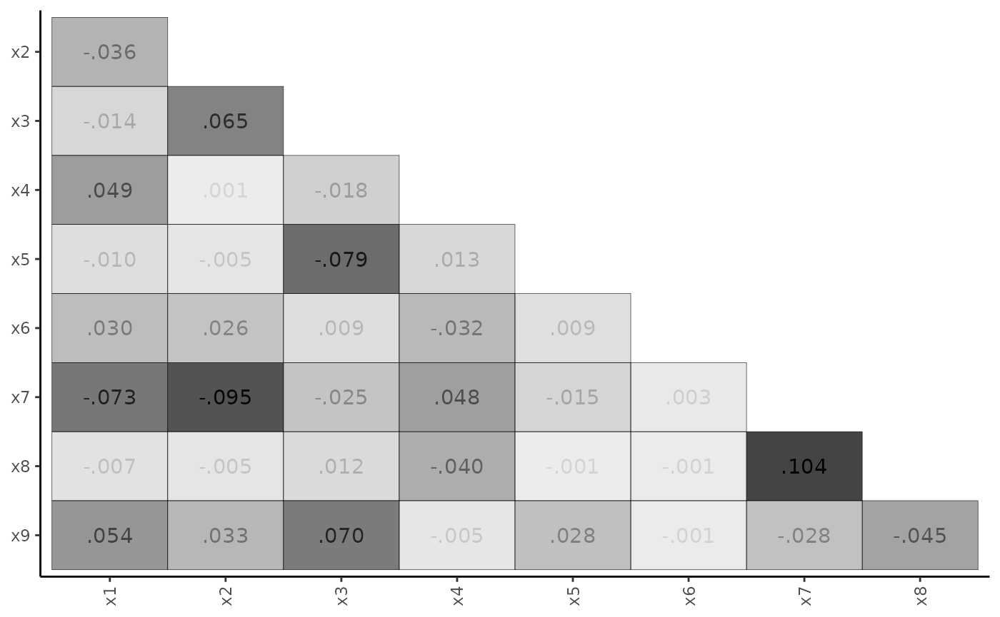

# Confirmatory Factor Analysis

## Basic CFA Model

We begin with a simple example of confirmatory factor analysis (CFA),
using
the[`minorbsem()`](https://jamesuanhoro.github.io/minorbsem/reference/minorbsem.md)
function to fit the model. The `minorbsem` package contains a built-in
dataset called `HS`, which is a part of classic Holzinger-Swineford
dataset. This dataset is used in many papers and books on CFA. The
dataset consists of mental ability test scores of seventh and eighth
grade children from two different schools (Pasteur and Grant-White). In
our version of the dataset (obtained from *lavaan*, Rosseel (2012)),
only 9 out of the original 26 tests are included.

We begin by loading the package:

``` r
library(minorbsem)
```

    ## 

    ## ###############################################################################

    ## This is minorbsem 0.2.16.9000

    ## 
    ## All users of R (or SEM) are invited to report bugs, submit functions or ideas
    ## for functions. An efficient way to do this is to open an issue on GitHub
    ## https://github.com/jamesuanhoro/minorbsem/issues/.

    ## ###############################################################################

The first six lines of the dataset:

``` r
head(HS)
```

    ##   id sex ageyr agemo  school grade       x1   x2    x3       x4   x5        x6       x7   x8
    ## 1  1   1    13     1 Pasteur     7 3.333333 7.75 0.375 2.333333 5.75 1.2857143 3.391304 5.75
    ## 2  2   2    13     7 Pasteur     7 5.333333 5.25 2.125 1.666667 3.00 1.2857143 3.782609 6.25
    ## 3  3   2    13     1 Pasteur     7 4.500000 5.25 1.875 1.000000 1.75 0.4285714 3.260870 3.90
    ## 4  4   1    13     2 Pasteur     7 5.333333 7.75 3.000 2.666667 4.50 2.4285714 3.000000 5.30
    ## 5  5   2    12     2 Pasteur     7 4.833333 4.75 0.875 2.666667 4.00 2.5714286 3.695652 6.30
    ## 6  6   2    14     1 Pasteur     7 5.333333 5.00 2.250 1.000000 3.00 0.8571429 4.347826 6.65
    ##         x9
    ## 1 6.361111
    ## 2 7.916667
    ## 3 4.416667
    ## 4 4.861111
    ## 5 5.916667
    ## 6 7.500000

### Data preparation

The scale of data is important for setting priors on model parameters.
The default priors for models fit with `minorbsem` are reasonable when
variables have standard deviations close to 1. For this reason, we first
check the standard deviations of the relevant variables for this
analysis:

``` r
item_data <- HS[, paste0("x", 1:9)] # select columns x1:x9
head(item_data) # show first six rows
```

    ##         x1   x2    x3       x4   x5        x6       x7   x8       x9
    ## 1 3.333333 7.75 0.375 2.333333 5.75 1.2857143 3.391304 5.75 6.361111
    ## 2 5.333333 5.25 2.125 1.666667 3.00 1.2857143 3.782609 6.25 7.916667
    ## 3 4.500000 5.25 1.875 1.000000 1.75 0.4285714 3.260870 3.90 4.416667
    ## 4 5.333333 7.75 3.000 2.666667 4.50 2.4285714 3.000000 5.30 4.861111
    ## 5 4.833333 4.75 0.875 2.666667 4.00 2.5714286 3.695652 6.30 5.916667
    ## 6 5.333333 5.00 2.250 1.000000 3.00 0.8571429 4.347826 6.65 7.500000

``` r
apply(item_data, 2, sd) # compute SD of each variable
```

    ##       x1       x2       x3       x4       x5       x6       x7       x8       x9 
    ## 1.167432 1.177451 1.130979 1.164116 1.290472 1.095603 1.089534 1.012615 1.009152

All variables have standard deviations close to 1, so we can move
forward with the data as they are. Otherwise, we would recommend
re-scaling the variables.[¹](#fn1)

### Model syntax

The model syntax is lavaan-style:

``` r
syntax_basic <- "
Visual =~ x1 + x2 + x3
Verbal =~ x4 + x5 + x6
Speed =~ x7 + x8 + x9"
```

This model assumes three latent variables (or factors): *visual*,
*verbal*, and *speed*. The visual factor has the indicators: x1, x2, and
x3; the verbal factor has indicators: x4, x5, and x6; the speed factor
has indicators: x7, x8, and x9.

### Fit the model

We run the analysis using the
[`minorbsem()`](https://jamesuanhoro.github.io/minorbsem/reference/minorbsem.md)
function. By default, the function assumes that minor factors influence
the covariance between the variables. `minorbsem` then prints out the
iterations from Stan – we show these iterations once so the reader knows
what to expect.

``` r
fit_cfa <- minorbsem(model = syntax_basic, data = HS)
```

    ## Processing user input ...

    ## User input fully processed :)
    ##  Now to modeling.

    ## Fitting Stan model ...

    ## Init values were only set for a subset of parameters. 
    ## Missing init values for the following parameters:
    ##  - chain 1: gdp_alpha, loadings, res_sds_u, phi_mat_chol, res_cor_01, coefs, sigma_loadings_complex, gdp_loadings_complex, Sigma
    ##  - chain 2: gdp_alpha, loadings, res_sds_u, phi_mat_chol, res_cor_01, coefs, sigma_loadings_complex, gdp_loadings_complex, Sigma
    ##  - chain 3: gdp_alpha, loadings, res_sds_u, phi_mat_chol, res_cor_01, coefs, sigma_loadings_complex, gdp_loadings_complex, Sigma
    ## 
    ## To disable this message use options(cmdstanr_warn_inits = FALSE).

    ## Running MCMC with 3 chains, at most 2 in parallel...
    ## 
    ## Chain 1 Iteration:    1 / 2000 [  0%]  (Warmup)

    ## Chain 1 Informational Message: The current Metropolis proposal is about to be rejected because of the following issue:

    ## Chain 1 Exception: lkj_corr_cholesky_lpdf: Random variable[2] is 0, but must be positive! (in '/tmp/RtmpfL4wEJ/model-248a5c6731c9.stan', line 324, column 2 to column 48)

    ## Chain 1 If this warning occurs sporadically, such as for highly constrained variable types like covariance matrices, then the sampler is fine,

    ## Chain 1 but if this warning occurs often then your model may be either severely ill-conditioned or misspecified.

    ## Chain 1

    ## Chain 1 Informational Message: The current Metropolis proposal is about to be rejected because of the following issue:

    ## Chain 1 Exception: lkj_corr_cholesky_lpdf: Random variable[2] is 0, but must be positive! (in '/tmp/RtmpfL4wEJ/model-248a5c6731c9.stan', line 324, column 2 to column 48)

    ## Chain 1 If this warning occurs sporadically, such as for highly constrained variable types like covariance matrices, then the sampler is fine,

    ## Chain 1 but if this warning occurs often then your model may be either severely ill-conditioned or misspecified.

    ## Chain 1

    ## Chain 1 Informational Message: The current Metropolis proposal is about to be rejected because of the following issue:

    ## Chain 1 Exception: cholesky_decompose: A is not symmetric. A[1,4] = inf, but A[4,1] = inf (in '/tmp/RtmpfL4wEJ/model-248a5c6731c9.stan', line 432, column 6 to column 81)

    ## Chain 1 If this warning occurs sporadically, such as for highly constrained variable types like covariance matrices, then the sampler is fine,

    ## Chain 1 but if this warning occurs often then your model may be either severely ill-conditioned or misspecified.

    ## Chain 1

    ## Chain 1 Informational Message: The current Metropolis proposal is about to be rejected because of the following issue:

    ## Chain 1 Exception: cholesky_decompose: Matrix m is not positive definite (in '/tmp/RtmpfL4wEJ/model-248a5c6731c9.stan', line 432, column 6 to column 81)

    ## Chain 1 If this warning occurs sporadically, such as for highly constrained variable types like covariance matrices, then the sampler is fine,

    ## Chain 1 but if this warning occurs often then your model may be either severely ill-conditioned or misspecified.

    ## Chain 1

    ## Chain 1 Informational Message: The current Metropolis proposal is about to be rejected because of the following issue:

    ## Chain 1 Exception: lkj_corr_cholesky_lpdf: Random variable[2] is 0, but must be positive! (in '/tmp/RtmpfL4wEJ/model-248a5c6731c9.stan', line 324, column 2 to column 48)

    ## Chain 1 If this warning occurs sporadically, such as for highly constrained variable types like covariance matrices, then the sampler is fine,

    ## Chain 1 but if this warning occurs often then your model may be either severely ill-conditioned or misspecified.

    ## Chain 1

    ## Chain 1 Informational Message: The current Metropolis proposal is about to be rejected because of the following issue:

    ## Chain 1 Exception: lkj_corr_cholesky_lpdf: Random variable[2] is 0, but must be positive! (in '/tmp/RtmpfL4wEJ/model-248a5c6731c9.stan', line 324, column 2 to column 48)

    ## Chain 1 If this warning occurs sporadically, such as for highly constrained variable types like covariance matrices, then the sampler is fine,

    ## Chain 1 but if this warning occurs often then your model may be either severely ill-conditioned or misspecified.

    ## Chain 1

    ## Chain 2 Iteration:    1 / 2000 [  0%]  (Warmup)

    ## Chain 2 Informational Message: The current Metropolis proposal is about to be rejected because of the following issue:

    ## Chain 2 Exception: cholesky_decompose: A is not symmetric. A[1,2] = inf, but A[2,1] = inf (in '/tmp/RtmpfL4wEJ/model-248a5c6731c9.stan', line 432, column 6 to column 81)

    ## Chain 2 If this warning occurs sporadically, such as for highly constrained variable types like covariance matrices, then the sampler is fine,

    ## Chain 2 but if this warning occurs often then your model may be either severely ill-conditioned or misspecified.

    ## Chain 2

    ## Chain 2 Informational Message: The current Metropolis proposal is about to be rejected because of the following issue:

    ## Chain 2 Exception: cholesky_decompose: A is not symmetric. A[1,2] = inf, but A[2,1] = inf (in '/tmp/RtmpfL4wEJ/model-248a5c6731c9.stan', line 432, column 6 to column 81)

    ## Chain 2 If this warning occurs sporadically, such as for highly constrained variable types like covariance matrices, then the sampler is fine,

    ## Chain 2 but if this warning occurs often then your model may be either severely ill-conditioned or misspecified.

    ## Chain 2

    ## Chain 2 Informational Message: The current Metropolis proposal is about to be rejected because of the following issue:

    ## Chain 2 Exception: cholesky_decompose: Matrix m is not positive definite (in '/tmp/RtmpfL4wEJ/model-248a5c6731c9.stan', line 432, column 6 to column 81)

    ## Chain 2 If this warning occurs sporadically, such as for highly constrained variable types like covariance matrices, then the sampler is fine,

    ## Chain 2 but if this warning occurs often then your model may be either severely ill-conditioned or misspecified.

    ## Chain 2

    ## Chain 2 Informational Message: The current Metropolis proposal is about to be rejected because of the following issue:

    ## Chain 2 Exception: cholesky_decompose: Matrix m is not positive definite (in '/tmp/RtmpfL4wEJ/model-248a5c6731c9.stan', line 432, column 6 to column 81)

    ## Chain 2 If this warning occurs sporadically, such as for highly constrained variable types like covariance matrices, then the sampler is fine,

    ## Chain 2 but if this warning occurs often then your model may be either severely ill-conditioned or misspecified.

    ## Chain 2

    ## Chain 2 Informational Message: The current Metropolis proposal is about to be rejected because of the following issue:

    ## Chain 2 Exception: lkj_corr_cholesky_lpdf: Random variable[2] is 0, but must be positive! (in '/tmp/RtmpfL4wEJ/model-248a5c6731c9.stan', line 324, column 2 to column 48)

    ## Chain 2 If this warning occurs sporadically, such as for highly constrained variable types like covariance matrices, then the sampler is fine,

    ## Chain 2 but if this warning occurs often then your model may be either severely ill-conditioned or misspecified.

    ## Chain 2

    ## Chain 2 Informational Message: The current Metropolis proposal is about to be rejected because of the following issue:

    ## Chain 2 Exception: cholesky_decompose: A is not symmetric. A[7,8] = inf, but A[8,7] = inf (in '/tmp/RtmpfL4wEJ/model-248a5c6731c9.stan', line 432, column 6 to column 81)

    ## Chain 2 If this warning occurs sporadically, such as for highly constrained variable types like covariance matrices, then the sampler is fine,

    ## Chain 2 but if this warning occurs often then your model may be either severely ill-conditioned or misspecified.

    ## Chain 2

    ## Chain 1 Iteration:  200 / 2000 [ 10%]  (Warmup)

    ## Chain 1 Informational Message: The current Metropolis proposal is about to be rejected because of the following issue:

    ## Chain 1 Exception: cholesky_decompose: Matrix m is not positive definite (in '/tmp/RtmpfL4wEJ/model-248a5c6731c9.stan', line 432, column 6 to column 81)

    ## Chain 1 If this warning occurs sporadically, such as for highly constrained variable types like covariance matrices, then the sampler is fine,

    ## Chain 1 but if this warning occurs often then your model may be either severely ill-conditioned or misspecified.

    ## Chain 1

    ## Chain 2 Iteration:  200 / 2000 [ 10%]  (Warmup) 
    ## Chain 1 Iteration:  400 / 2000 [ 20%]  (Warmup) 
    ## Chain 2 Iteration:  400 / 2000 [ 20%]  (Warmup) 
    ## Chain 1 Iteration:  600 / 2000 [ 30%]  (Warmup) 
    ## Chain 2 Iteration:  600 / 2000 [ 30%]  (Warmup) 
    ## Chain 1 Iteration:  800 / 2000 [ 40%]  (Warmup) 
    ## Chain 2 Iteration:  800 / 2000 [ 40%]  (Warmup)

    ## Chain 1 Informational Message: The current Metropolis proposal is about to be rejected because of the following issue:

    ## Chain 1 Exception: cholesky_decompose: Matrix m is not positive definite (in '/tmp/RtmpfL4wEJ/model-248a5c6731c9.stan', line 432, column 6 to column 81)

    ## Chain 1 If this warning occurs sporadically, such as for highly constrained variable types like covariance matrices, then the sampler is fine,

    ## Chain 1 but if this warning occurs often then your model may be either severely ill-conditioned or misspecified.

    ## Chain 1

    ## Chain 2 Iteration: 1000 / 2000 [ 50%]  (Warmup) 
    ## Chain 2 Iteration: 1001 / 2000 [ 50%]  (Sampling) 
    ## Chain 1 Iteration: 1000 / 2000 [ 50%]  (Warmup) 
    ## Chain 1 Iteration: 1001 / 2000 [ 50%]  (Sampling) 
    ## Chain 2 Iteration: 1200 / 2000 [ 60%]  (Sampling) 
    ## Chain 1 Iteration: 1200 / 2000 [ 60%]  (Sampling) 
    ## Chain 2 Iteration: 1400 / 2000 [ 70%]  (Sampling) 
    ## Chain 1 Iteration: 1400 / 2000 [ 70%]  (Sampling) 
    ## Chain 1 Iteration: 1600 / 2000 [ 80%]  (Sampling) 
    ## Chain 2 Iteration: 1600 / 2000 [ 80%]  (Sampling) 
    ## Chain 2 Iteration: 1800 / 2000 [ 90%]  (Sampling) 
    ## Chain 1 Iteration: 1800 / 2000 [ 90%]  (Sampling) 
    ## Chain 1 Iteration: 2000 / 2000 [100%]  (Sampling) 
    ## Chain 2 Iteration: 2000 / 2000 [100%]  (Sampling) 
    ## Chain 1 finished in 3.8 seconds.
    ## Chain 2 finished in 3.8 seconds.
    ## Chain 3 Iteration:    1 / 2000 [  0%]  (Warmup)

    ## Chain 3 Informational Message: The current Metropolis proposal is about to be rejected because of the following issue:

    ## Chain 3 Exception: lkj_corr_cholesky_lpdf: Random variable[2] is 0, but must be positive! (in '/tmp/RtmpfL4wEJ/model-248a5c6731c9.stan', line 324, column 2 to column 48)

    ## Chain 3 If this warning occurs sporadically, such as for highly constrained variable types like covariance matrices, then the sampler is fine,

    ## Chain 3 but if this warning occurs often then your model may be either severely ill-conditioned or misspecified.

    ## Chain 3

    ## Chain 3 Informational Message: The current Metropolis proposal is about to be rejected because of the following issue:

    ## Chain 3 Exception: lkj_corr_cholesky_lpdf: Random variable[2] is 0, but must be positive! (in '/tmp/RtmpfL4wEJ/model-248a5c6731c9.stan', line 324, column 2 to column 48)

    ## Chain 3 If this warning occurs sporadically, such as for highly constrained variable types like covariance matrices, then the sampler is fine,

    ## Chain 3 but if this warning occurs often then your model may be either severely ill-conditioned or misspecified.

    ## Chain 3

    ## Chain 3 Informational Message: The current Metropolis proposal is about to be rejected because of the following issue:

    ## Chain 3 Exception: cholesky_decompose: Matrix m is not positive definite (in '/tmp/RtmpfL4wEJ/model-248a5c6731c9.stan', line 432, column 6 to column 81)

    ## Chain 3 If this warning occurs sporadically, such as for highly constrained variable types like covariance matrices, then the sampler is fine,

    ## Chain 3 but if this warning occurs often then your model may be either severely ill-conditioned or misspecified.

    ## Chain 3

    ## Chain 3 Informational Message: The current Metropolis proposal is about to be rejected because of the following issue:

    ## Chain 3 Exception: cholesky_decompose: Matrix m is not positive definite (in '/tmp/RtmpfL4wEJ/model-248a5c6731c9.stan', line 432, column 6 to column 81)

    ## Chain 3 If this warning occurs sporadically, such as for highly constrained variable types like covariance matrices, then the sampler is fine,

    ## Chain 3 but if this warning occurs often then your model may be either severely ill-conditioned or misspecified.

    ## Chain 3

    ## Chain 3 Informational Message: The current Metropolis proposal is about to be rejected because of the following issue:

    ## Chain 3 Exception: lkj_corr_cholesky_lpdf: Random variable[2] is 0, but must be positive! (in '/tmp/RtmpfL4wEJ/model-248a5c6731c9.stan', line 324, column 2 to column 48)

    ## Chain 3 If this warning occurs sporadically, such as for highly constrained variable types like covariance matrices, then the sampler is fine,

    ## Chain 3 but if this warning occurs often then your model may be either severely ill-conditioned or misspecified.

    ## Chain 3

    ## Chain 3 Informational Message: The current Metropolis proposal is about to be rejected because of the following issue:

    ## Chain 3 Exception: cholesky_decompose: Matrix m is not positive definite (in '/tmp/RtmpfL4wEJ/model-248a5c6731c9.stan', line 432, column 6 to column 81)

    ## Chain 3 If this warning occurs sporadically, such as for highly constrained variable types like covariance matrices, then the sampler is fine,

    ## Chain 3 but if this warning occurs often then your model may be either severely ill-conditioned or misspecified.

    ## Chain 3

    ## Chain 3 Informational Message: The current Metropolis proposal is about to be rejected because of the following issue:

    ## Chain 3 Exception: cholesky_decompose: Matrix m is not positive definite (in '/tmp/RtmpfL4wEJ/model-248a5c6731c9.stan', line 432, column 6 to column 81)

    ## Chain 3 If this warning occurs sporadically, such as for highly constrained variable types like covariance matrices, then the sampler is fine,

    ## Chain 3 but if this warning occurs often then your model may be either severely ill-conditioned or misspecified.

    ## Chain 3

    ## Chain 3 Informational Message: The current Metropolis proposal is about to be rejected because of the following issue:

    ## Chain 3 Exception: cholesky_decompose: Matrix m is not positive definite (in '/tmp/RtmpfL4wEJ/model-248a5c6731c9.stan', line 432, column 6 to column 81)

    ## Chain 3 If this warning occurs sporadically, such as for highly constrained variable types like covariance matrices, then the sampler is fine,

    ## Chain 3 but if this warning occurs often then your model may be either severely ill-conditioned or misspecified.

    ## Chain 3

    ## Chain 3 Iteration:  200 / 2000 [ 10%]  (Warmup)

    ## Chain 3 Informational Message: The current Metropolis proposal is about to be rejected because of the following issue:

    ## Chain 3 Exception: cholesky_decompose: Matrix m is not positive definite (in '/tmp/RtmpfL4wEJ/model-248a5c6731c9.stan', line 432, column 6 to column 81)

    ## Chain 3 If this warning occurs sporadically, such as for highly constrained variable types like covariance matrices, then the sampler is fine,

    ## Chain 3 but if this warning occurs often then your model may be either severely ill-conditioned or misspecified.

    ## Chain 3

    ## Chain 3 Iteration:  400 / 2000 [ 20%]  (Warmup)

    ## Chain 3 Informational Message: The current Metropolis proposal is about to be rejected because of the following issue:

    ## Chain 3 Exception: cholesky_decompose: Matrix m is not positive definite (in '/tmp/RtmpfL4wEJ/model-248a5c6731c9.stan', line 432, column 6 to column 81)

    ## Chain 3 If this warning occurs sporadically, such as for highly constrained variable types like covariance matrices, then the sampler is fine,

    ## Chain 3 but if this warning occurs often then your model may be either severely ill-conditioned or misspecified.

    ## Chain 3

    ## Chain 3 Iteration:  600 / 2000 [ 30%]  (Warmup) 
    ## Chain 3 Iteration:  800 / 2000 [ 40%]  (Warmup) 
    ## Chain 3 Iteration: 1000 / 2000 [ 50%]  (Warmup) 
    ## Chain 3 Iteration: 1001 / 2000 [ 50%]  (Sampling) 
    ## Chain 3 Iteration: 1200 / 2000 [ 60%]  (Sampling) 
    ## Chain 3 Iteration: 1400 / 2000 [ 70%]  (Sampling) 
    ## Chain 3 Iteration: 1600 / 2000 [ 80%]  (Sampling) 
    ## Chain 3 Iteration: 1800 / 2000 [ 90%]  (Sampling) 
    ## Chain 3 Iteration: 2000 / 2000 [100%]  (Sampling) 
    ## Chain 3 finished in 4.3 seconds.
    ## 
    ## All 3 chains finished successfully.
    ## Mean chain execution time: 3.9 seconds.
    ## Total execution time: 8.2 seconds.

    ## Warning: 1 of 3000 (0.0%) transitions ended with a divergence.
    ## See https://mc-stan.org/misc/warnings for details.

    ##                     Parameter estimates (method = normal, sample size(s) = 301)                     
    ##              from     op   to        mean      sd   5.000%   95.000%    rhat   ess_bulk  
    ##            ──────────────────────────────────────────────────────────────────────────────
    ##              Goodness of fit                                                             
    ##            ──────────────────────────────────────────────────────────────────────────────
    ##              PPP                    0.399                              1.002       1846  
    ##              RMSE                   0.064   0.015    0.042     0.090   1.004        698  
    ##            ──────────────────────────────────────────────────────────────────────────────
    ##              Factor loadings                                                             
    ##            ──────────────────────────────────────────────────────────────────────────────
    ##              Visual   =~   x1       0.937   0.129    0.736     1.157   1.001       1290  
    ##              Visual   =~   x2       0.468   0.106    0.296     0.644   1.001       2438  
    ##              Visual   =~   x3       0.625   0.109    0.454     0.803   1.002       1804  
    ##              Verbal   =~   x4       1.000   0.091    0.854     1.159   1.002       1425  
    ##              Verbal   =~   x5       1.068   0.099    0.910     1.237   1.001       1406  
    ##              Verbal   =~   x6       0.932   0.091    0.788     1.087   1.001       1433  
    ##              Speed    =~   x7       0.560   0.104    0.391     0.729   1.000       1652  
    ##              Speed    =~   x8       0.678   0.105    0.508     0.849   1.003       1157  
    ##              Speed    =~   x9       0.788   0.119    0.599     0.996   1.000        985  
    ##            ──────────────────────────────────────────────────────────────────────────────
    ##              Inter-factor correlations                                                   
    ##            ──────────────────────────────────────────────────────────────────────────────
    ##              Verbal   ~~   Visual   0.426   0.080    0.291     0.557   1.000       2028  
    ##              Speed    ~~   Visual   0.467   0.100    0.301     0.629   1.004       1581  
    ##              Speed    ~~   Verbal   0.276   0.080    0.144     0.409   1.004       2863  
    ##            ──────────────────────────────────────────────────────────────────────────────
    ##              Residual variances                                                          
    ##            ──────────────────────────────────────────────────────────────────────────────
    ##              x1       ~~   x1       0.465   0.221    0.039     0.787   1.001       1161  
    ##              x2       ~~   x2       1.162   0.126    0.964     1.370   1.002       2473  
    ##              x3       ~~   x3       0.879   0.133    0.664     1.092   1.001       1748  
    ##              x4       ~~   x4       0.349   0.154    0.065     0.590   1.004       1007  
    ##              x5       ~~   x5       0.511   0.180    0.190     0.789   1.001       1271  
    ##              x6       ~~   x6       0.329   0.140    0.072     0.544   1.003       1161  
    ##              x7       ~~   x7       0.872   0.116    0.681     1.062   1.001       1612  
    ##              x8       ~~   x8       0.576   0.132    0.347     0.777   1.001       1249  
    ##              x9       ~~   x9       0.402   0.171    0.073     0.652   1.001        837  
    ##            ──────────────────────────────────────────────────────────────────────────────
    ##                                                                                          
    ## 
    ## Column names: from, op, to, mean, sd, 5%, 95%, rhat, ess_bulk

#### Output structure

At the top of the results table, `method = normal` indicates the
approach of estimating the residual covariances between all items: the
belief is that the standardized residual covariances (SRCs) which
reflect minor factor influences are normally distributed with zero mean.
The table also prints out the sample size of 301 – only complete rows
are retained for analysis.

We describe the column headers. The `from`, `op` and `to` combination
describe the type of parameter being reported according to lavaan-style
syntax. For example, the `Visual =~ x1` row describes the loading from
the visual factor to item x1. The `mean`, `sd` and percentage columns
are descriptive statistics of posterior distributions. The `mean` and
`sd` function like the estimate and standard error in standard
frequentist statistics. The percentage columns are credible intervals.
By default, they are 90% credible intervals, i.e. given the prior and
data, there is a 90% chance the parameter falls in this interval. `rhat`
(pronounced R-hat) and `ess_bulk` columns are the potential scale
reduction factor ($\widehat{R}$) and effective sample size (ESS)
respectively (Vehtari et al. 2021) – they are useful for checking
parameter convergence. For $\widehat{R}$, values very close to 1 are
preferable. For ESS, larger values are preferable. A final analysis in a
manuscript would ideally have all parameters with $\widehat{R}$ under
1.01 and ESS above 400 for one to be sure parameter estimates have
converged (Vehtari et al. 2021). An easy way to meet these expectations
is to increase the number of requested samples when calling
[`minorbsem()`](https://jamesuanhoro.github.io/minorbsem/reference/minorbsem.md)
via the `warmup =` and `sampling =` arguments, see
[`?minorbsem`](https://jamesuanhoro.github.io/minorbsem/reference/minorbsem.md).

The parameter estimates are presented by the type of parameter.

#### Goodness of fit

**PPP**. The first section of results contains parameters that help
assess global model fit. “PPP” is the posterior predictive *p*-value in
the form described by Muthén and Asparouhov (2012), and is akin to a
$\chi^{2}$ test in standard SEMs. It is conventional to prefer values
under .05 or .10. Here, PPP = .382 indicating a good-fitting model.
Desirable PPP-values are to be expected by default in `minorbsem` as the
package accounts for model misspecification – alternatively stated:
PPP-values above .05 do not imply an absence of misfit and is not all
that informative by default. We report PPP since `minorbsem` is also
able to fit Bayesian SEMs that do not account for misspecification,
e.g. `minorbsem(..., method = "none")`.

**RMSE**. This the root mean square error of standardized residual
covariances (SRCs) and communicates the typical size of SRCs. One may
also interpret this metric as the standard deviation of SRCs with 95% of
SRCs lying within 2 RMSE values from 0. In this example, RMSE = 0.063
and we can expect some SRCs to be greater than 0.10, suggesting some
large SRCs (Maydeu-Olivares 2017). Large SRCs challenge the notion that
model misspecification is due to the influence of minor factors – if
these influences are large, are these factors “minor”? It is possible
that the hypothesized structure is incorrect, or minor factors have
significant effects.

#### Substantive parameters

The parameter estimates are reported by type of parameter: factor
loadings, inter-factor correlations, and error variances. For this
model, all items load on their respective factors with intervals that
clearly exclude 0. All factors are assumed standardized in minorbsem, so
only their correlations are reported; and all factors are non-trivially
correlated.

### Residual plots

Given that the RMSE suggests large standardized residual covariances
(SRCs), we can request a plot of SRCs using two options: a range-plot
and a heat-map.

``` r
plot_residuals(fit_cfa, type = "range")
```


``` r
plot_residuals(fit_cfa, type = "matrix")
```



The heat-map is particularly useful for highlighting the largest SRCs.
If these SRCs cluster in a non-random way, one may identify potential
model modifications.

## Bifactor model with orthogonal factors

To improve on the basic model, we consider the bifactor structure, which
builds on the basic CFA model by specifying a general factor ‘G’ that is
reflected in all nine indicators. All factors are assumed orthogonal.

### Model syntax

``` r
syntax_bifactor <- paste0(
  "G =~ x1 + x2 + x3 + x4 + x5 + x6 + x7 + x8 + x9", "\n",
  syntax_basic
)
writeLines(syntax_bifactor)
```

    ## G =~ x1 + x2 + x3 + x4 + x5 + x6 + x7 + x8 + x9
    ## 
    ## Visual =~ x1 + x2 + x3
    ## Verbal =~ x4 + x5 + x6
    ## Speed =~ x7 + x8 + x9

### Fit the model

The call to
[`minorbsem()`](https://jamesuanhoro.github.io/minorbsem/reference/minorbsem.md)
needs to be of the form: `minorbsem(..., orthogonal = TRUE)` to ensure
the factors are orthogonal:

``` r
fit_bifactor <- minorbsem(syntax_bifactor, data = HS, orthogonal = TRUE)
```

    ##                     Parameter estimates (method = normal, sample size(s) = 301)                     
    ##             from     op   to         mean      sd   5.000%   95.000%    rhat   ess_bulk  
    ##           ───────────────────────────────────────────────────────────────────────────────
    ##             Goodness of fit                                                              
    ##           ───────────────────────────────────────────────────────────────────────────────
    ##             PPP                     0.386                              1.001       1980  
    ##             RMSE                    0.027   0.012    0.007     0.048   1.008        531  
    ##           ───────────────────────────────────────────────────────────────────────────────
    ##             Factor loadings                                                              
    ##           ───────────────────────────────────────────────────────────────────────────────
    ##             G        =~   x1        0.946   0.111    0.759     1.128   1.000       1190  
    ##             G        =~   x2        0.485   0.110    0.313     0.667   1.001       2079  
    ##             G        =~   x3        0.625   0.100    0.457     0.790   1.000       2145  
    ##             G        =~   x4        0.473   0.083    0.345     0.614   1.003       2003  
    ##             G        =~   x5        0.428   0.093    0.274     0.583   1.006       1564  
    ##             G        =~   x6        0.463   0.079    0.338     0.597   1.004       2046  
    ##             G        =~   x7        0.110   0.083   -0.023     0.247   1.001       1920  
    ##             G        =~   x8        0.288   0.076    0.169     0.412   1.000       2245  
    ##             G        =~   x9        0.511   0.077    0.390     0.639   1.003       1756  
    ##             Visual   =~   x1        0.222   0.178    0.016     0.587   1.001       1537  
    ##             Visual   =~   x2       -0.117   0.510   -0.957     0.804   1.000       1421  
    ##             Visual   =~   x3        0.005   0.491   -0.796     0.903   1.000       1350  
    ##             Verbal   =~   x4        0.859   0.076    0.733     0.985   1.002       2186  
    ##             Verbal   =~   x5        1.050   0.086    0.911     1.192   1.002       1519  
    ##             Verbal   =~   x6        0.785   0.072    0.667     0.905   1.000       2204  
    ##             Speed    =~   x7        0.726   0.115    0.539     0.922   1.004       1108  
    ##             Speed    =~   x8        0.712   0.110    0.537     0.904   1.004       1038  
    ##             Speed    =~   x9        0.432   0.079    0.301     0.562   1.001       2051  
    ##           ───────────────────────────────────────────────────────────────────────────────
    ##             Inter-factor correlations                                                    
    ##           ───────────────────────────────────────────────────────────────────────────────
    ##             Visual   ~~   G         0.000   0.000    0.000     0.000                     
    ##             Verbal   ~~   G         0.000   0.000    0.000     0.000                     
    ##             Verbal   ~~   Visual    0.000   0.000    0.000     0.000                     
    ##             Speed    ~~   G         0.000   0.000    0.000     0.000                     
    ##             Speed    ~~   Visual    0.000   0.000    0.000     0.000                     
    ##             Speed    ~~   Verbal    0.000   0.000    0.000     0.000                     
    ##           ───────────────────────────────────────────────────────────────────────────────
    ##             Residual variances                                                           
    ##           ───────────────────────────────────────────────────────────────────────────────
    ##             x1       ~~   x1        0.405   0.217    0.020     0.719   1.002        938  
    ##             x2       ~~   x2        0.893   0.341    0.092     1.273   1.000       1197  
    ##             x3       ~~   x3        0.662   0.281    0.046     0.994   1.003       1058  
    ##             x4       ~~   x4        0.393   0.085    0.248     0.525   1.003       1799  
    ##             x5       ~~   x5        0.386   0.126    0.160     0.583   1.004       1248  
    ##             x6       ~~   x6        0.378   0.074    0.258     0.500   1.000       1936  
    ##             x7       ~~   x7        0.648   0.155    0.367     0.878   1.005       1039  
    ##             x8       ~~   x8        0.438   0.141    0.169     0.644   1.004       1020  
    ##             x9       ~~   x9        0.579   0.075    0.459     0.702   1.002       2549  
    ##           ───────────────────────────────────────────────────────────────────────────────
    ##                                                                                          
    ## 
    ## Column names: from, op, to, mean, sd, 5%, 95%, rhat, ess_bulk

Compared to the basic CFA model, the RMSE drops from .063 to .028,
suggesting a much better fitting model. All items load with 90%
intervals excluding 0 on the general factor, except for x7.
Additionally, x1 – x3 load confusingly on their specific factor, while
x4 – x9 load strongly on their specific factors especially when compared
to their general factor loadings. This pattern of factor loadings
provide little support for a bifactor structure.

## Bifactor model with parameter constraints

We instead explore a more constrained bifactor structure where specific
factor loadings are forced equal within each specific factor. Note that
minorbsem uses the same parameter constraint syntax as lavaan:

### Model syntax

``` r
syntax_bifactor_cons <- paste0(
  "G =~ x1 + x2 + x3 + x4 + x5 + x6 + x7 + x8 + x9", "\n",
  "Visual =~ a * x1 + a * x2 + a * x3
  Verbal =~ b * x4 + b * x5 + b * x6
  Speed =~ c * x7 + c * x8 + c * x9"
)
```

### Fit the model

``` r
fit_bifactor_cons <- fit_bifactor_cons <- minorbsem(
  syntax_bifactor_cons,
  data = HS, orthogonal = TRUE
)
```

    ##                     Parameter estimates (method = normal, sample size(s) = 301)                     
    ##              from     op   to        mean      sd   5.000%   95.000%    rhat   ess_bulk  
    ##            ──────────────────────────────────────────────────────────────────────────────
    ##              Goodness of fit                                                             
    ##            ──────────────────────────────────────────────────────────────────────────────
    ##              PPP                    0.399                              1.000       2217  
    ##              RMSE                   0.047   0.012    0.030     0.069   1.001        995  
    ##            ──────────────────────────────────────────────────────────────────────────────
    ##              Factor loadings                                                             
    ##            ──────────────────────────────────────────────────────────────────────────────
    ##              G        =~   x1       0.863   0.116    0.675     1.056   1.001       2127  
    ##              G        =~   x2       0.431   0.113    0.247     0.611   1.000       2512  
    ##              G        =~   x3       0.571   0.112    0.383     0.749   1.001       1971  
    ##              G        =~   x4       0.500   0.102    0.336     0.670   1.001       2116  
    ##              G        =~   x5       0.491   0.115    0.304     0.682   1.000       2004  
    ##              G        =~   x6       0.474   0.094    0.324     0.630   1.000       2448  
    ##              G        =~   x7       0.132   0.100   -0.030     0.299   1.002       2072  
    ##              G        =~   x8       0.285   0.088    0.143     0.428   1.002       2581  
    ##              G        =~   x9       0.517   0.084    0.381     0.653   1.001       2704  
    ##              Visual   =~   x1       0.286   0.148    0.038     0.516   1.002       1502  
    ##              Visual   =~   x2       0.286   0.148    0.038     0.516   1.002       1502  
    ##              Visual   =~   x3       0.286   0.148    0.038     0.516   1.002       1502  
    ##              Verbal   =~   x4       0.863   0.060    0.765     0.961   1.002       2152  
    ##              Verbal   =~   x5       0.863   0.060    0.765     0.961   1.002       2152  
    ##              Verbal   =~   x6       0.863   0.060    0.765     0.961   1.002       2152  
    ##              Speed    =~   x7       0.605   0.054    0.513     0.689   1.001       2851  
    ##              Speed    =~   x8       0.605   0.054    0.513     0.689   1.001       2851  
    ##              Speed    =~   x9       0.605   0.054    0.513     0.689   1.001       2851  
    ##            ──────────────────────────────────────────────────────────────────────────────
    ##              Inter-factor correlations                                                   
    ##            ──────────────────────────────────────────────────────────────────────────────
    ##              Visual   ~~   G        0.000   0.000    0.000     0.000                     
    ##              Verbal   ~~   G        0.000   0.000    0.000     0.000                     
    ##              Verbal   ~~   Visual   0.000   0.000    0.000     0.000                     
    ##              Speed    ~~   G        0.000   0.000    0.000     0.000                     
    ##              Speed    ~~   Visual   0.000   0.000    0.000     0.000                     
    ##              Speed    ~~   Verbal   0.000   0.000    0.000     0.000                     
    ##            ──────────────────────────────────────────────────────────────────────────────
    ##              Residual variances                                                          
    ##            ──────────────────────────────────────────────────────────────────────────────
    ##              x1       ~~   x1       0.531   0.160    0.248     0.776   1.003       2027  
    ##              x2       ~~   x2       1.106   0.115    0.924     1.308   1.000       3411  
    ##              x3       ~~   x3       0.852   0.108    0.675     1.034   1.001       3128  
    ##              x4       ~~   x4       0.353   0.082    0.214     0.484   1.001       2578  
    ##              x5       ~~   x5       0.622   0.094    0.470     0.780   1.001       2854  
    ##              x6       ~~   x6       0.255   0.077    0.122     0.377   1.000       2681  
    ##              x7       ~~   x7       0.776   0.088    0.641     0.931   1.001       3979  
    ##              x8       ~~   x8       0.566   0.072    0.455     0.689   1.002       3554  
    ##              x9       ~~   x9       0.426   0.086    0.284     0.563   1.004       2542  
    ##            ──────────────────────────────────────────────────────────────────────────────
    ##                                                                                          
    ## 
    ## Column names: from, op, to, mean, sd, 5%, 95%, rhat, ess_bulk

The RMSE increased since the model is more constrained. The pattern of
results with the parameter constraints imposed suggest the general
factor mostly reflects items x1 – x3, with other items more strongly
reflecting their specific factors. These results suggest limited
applicability of the bifactor model for these data.

## Non-Simple Structure Model

For our final model, we return to the original basic CFA and relax
simple structure. Unlike Muthén and Asparouhov (2012) who do this using
small-variance priors, minorbsem does this using a global-local prior
(Uanhoro 2024). Precisely, this approach assumes that most
cross-loadings are indeed zero and there are some outlier non-zero cross
loadings.

### Fit the model

The call to
[`minorbsem()`](https://jamesuanhoro.github.io/minorbsem/reference/minorbsem.md)
needs to be of the form: `minorbsem(..., simple_struc = FALSE)`

``` r
fit_non_simple <- minorbsem(syntax_basic, data = HS, simple_struc = FALSE)
```

    ##                     Parameter estimates (method = normal, sample size(s) = 301)                     
    ##             from     op   to         mean      sd   5.000%   95.000%    rhat   ess_bulk  
    ##           ───────────────────────────────────────────────────────────────────────────────
    ##             Goodness of fit                                                              
    ##           ───────────────────────────────────────────────────────────────────────────────
    ##             PPP                     0.479                              1.001       1883  
    ##             RMSE                    0.025   0.012    0.006     0.047   1.003        470  
    ##           ───────────────────────────────────────────────────────────────────────────────
    ##             Factor loadings                                                              
    ##           ───────────────────────────────────────────────────────────────────────────────
    ##             Visual   =~   x1        0.758   0.118    0.567     0.952   1.000       1155  
    ##             Visual   =~   x2        0.565   0.096    0.407     0.722   1.002       1830  
    ##             Visual   =~   x3        0.753   0.111    0.581     0.939   1.000       1510  
    ##             Visual   =~   x4        0.025   0.071   -0.082     0.152   1.001       1941  
    ##             Visual   =~   x5       -0.063   0.091   -0.226     0.061   1.002       1340  
    ##             Visual   =~   x6        0.059   0.077   -0.044     0.202   1.002       1719  
    ##             Visual   =~   x7       -0.139   0.146   -0.424     0.035   1.000       1058  
    ##             Visual   =~   x8        0.046   0.115   -0.124     0.260   1.001       1274  
    ##             Visual   =~   x9        0.318   0.120    0.109     0.505   1.000       1300  
    ##             Verbal   =~   x1        0.138   0.111   -0.024     0.330   1.000       1087  
    ##             Verbal   =~   x2        0.011   0.067   -0.097     0.128   1.004       1672  
    ##             Verbal   =~   x3       -0.075   0.095   -0.259     0.046   1.001       1158  
    ##             Verbal   =~   x4        0.986   0.075    0.863     1.109   1.002       1322  
    ##             Verbal   =~   x5        1.144   0.090    1.004     1.296   1.003        614  
    ##             Verbal   =~   x6        0.891   0.073    0.772     1.010   1.002       1680  
    ##             Verbal   =~   x7        0.026   0.076   -0.085     0.157   1.001       1964  
    ##             Verbal   =~   x8       -0.030   0.074   -0.165     0.076   1.002       1765  
    ##             Verbal   =~   x9        0.013   0.061   -0.084     0.118   1.000       2262  
    ##             Speed    =~   x1        0.037   0.083   -0.080     0.191   1.000       1691  
    ##             Speed    =~   x2       -0.053   0.079   -0.202     0.049   1.006       2176  
    ##             Speed    =~   x3        0.031   0.081   -0.082     0.183   1.003       2201  
    ##             Speed    =~   x4        0.002   0.058   -0.091     0.096   1.001       2388  
    ##             Speed    =~   x5        0.003   0.066   -0.102     0.110   1.000       2574  
    ##             Speed    =~   x6        0.000   0.054   -0.088     0.091   1.000       2552  
    ##             Speed    =~   x7        0.761   0.122    0.570     0.976   1.004        880  
    ##             Speed    =~   x8        0.764   0.105    0.596     0.949   1.002        830  
    ##             Speed    =~   x9        0.501   0.094    0.354     0.662   1.001       1182  
    ##           ───────────────────────────────────────────────────────────────────────────────
    ##             Inter-factor correlations                                                    
    ##           ───────────────────────────────────────────────────────────────────────────────
    ##             Verbal   ~~   Visual    0.362   0.121    0.150     0.545   1.000       1174  
    ##             Speed    ~~   Visual    0.278   0.170   -0.012     0.539   1.004        937  
    ##             Speed    ~~   Verbal    0.226   0.124    0.020     0.420   1.003       1215  
    ##           ───────────────────────────────────────────────────────────────────────────────
    ##             Residual variances                                                           
    ##           ───────────────────────────────────────────────────────────────────────────────
    ##             x1       ~~   x1        0.674   0.124    0.464     0.868   1.002       1560  
    ##             x2       ~~   x2        1.084   0.109    0.916     1.271   1.000       2691  
    ##             x3       ~~   x3        0.743   0.125    0.535     0.944   1.001       1537  
    ##             x4       ~~   x4        0.373   0.085    0.229     0.510   1.004       1040  
    ##             x5       ~~   x5        0.417   0.118    0.223     0.594   1.006        466  
    ##             x6       ~~   x6        0.375   0.071    0.257     0.492   1.001       1354  
    ##             x7       ~~   x7        0.657   0.141    0.420     0.882   1.002        922  
    ##             x8       ~~   x8        0.451   0.130    0.201     0.640   1.000        686  
    ##             x9       ~~   x9        0.572   0.075    0.453     0.697   1.001       1910  
    ##           ───────────────────────────────────────────────────────────────────────────────
    ##                                                                                          
    ## 
    ## Column names: from, op, to, mean, sd, 5%, 95%, rhat, ess_bulk

The effect of minor factors is small, RMSE = 0.024. The original
hypothesized loadings maintain their relation to their hypothesized
factors. Of the cross-loadings, only the relation from the visual factor
to x9 is non-trivial, with most being very close to 0. Additionally, the
interfactor correlations have all reduced from the original basic CFA,
suggesting that forcing cross-loadings to zero artificially inflated
interfactor correlations (Ferrando and Lorenzo-Seva 2000).

## Works Cited

Ferrando, Pere J, and Urbano Lorenzo-Seva. 2000. “Unrestricted Versus
Restricted Factor Analysis of Multidimensional Test Items: Some Aspects
of the Problem and Some Suggestions.” *Psicológica* 21 (2): 301–23.
<https://www.uv.es/revispsi/articulos3.00/ferran7.pdf>.

Maydeu-Olivares, Alberto. 2017. “Assessing the Size of Model Misfit in
Structural Equation Models.” *Psychometrika* 82 (3): 533–58.
<https://doi.org/10.1007/s11336-016-9552-7>.

Muthén, Bengt, and Tihomir Asparouhov. 2012. “Bayesian Structural
Equation Modeling: A More Flexible Representation of Substantive
Theory.” *Psychological Methods* 17 (3): 313–35.
<https://doi.org/10.1037/a0026802>.

Rosseel, Yves. 2012. “Lavaan: An R Package for Structural Equation
Modeling.” *Journal of Statistical Software* 48 (2): 1–20.
<https://doi.org/10.18637/jss.v048.i02>.

Uanhoro, James O. 2024. “A Comparison of Different Prior Choices for
Estimating the Influence of Minor Factors in Bayesian Structural
Equation Models.” In *Annual Meeting of the American Educational
Research Association*. Philadelphia, PA.

Vehtari, Aki, Andrew Gelman, Daniel Simpson, Bob Carpenter, and
Paul-Christian Bürkner. 2021. “Rank-Normalization, Folding, and
Localization: An Improved $\widehat{R}$ for Assessing Convergence of
MCMC (with Discussion).” *Bayesian Analysis* 16 (2): 667–718.
<https://doi.org/10.1214/20-BA1221>.

------------------------------------------------------------------------

1.  In the situation where variable scales have no information value,
    one can do a correlation-structure analysis instead using syntax of
    the form: `minorbsem(..., correlation = TRUE)`.
