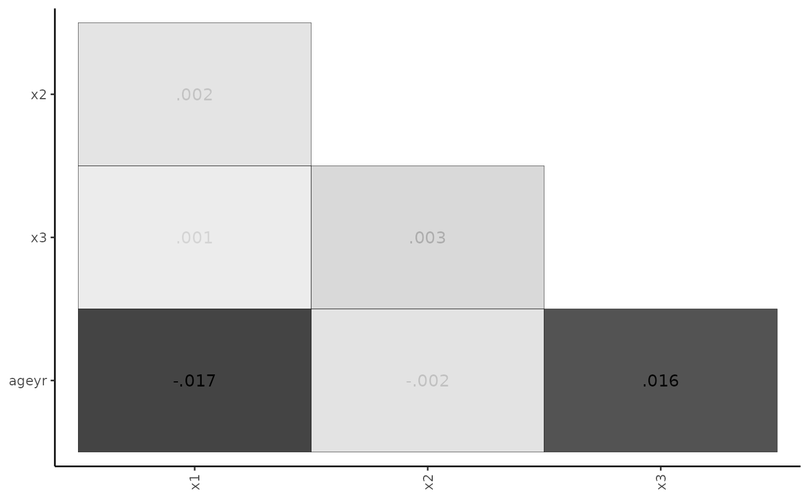
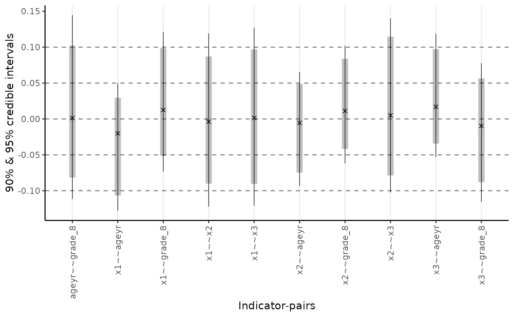
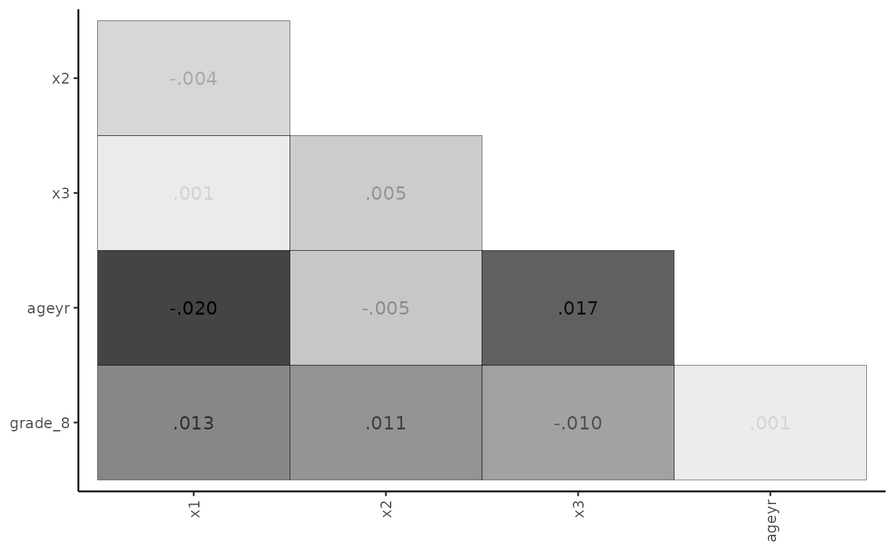

# Multiple Indicators and Multiple Causes (MIMIC) Model

Now we use
the[`minorbsem()`](https://jamesuanhoro.github.io/minorbsem/reference/minorbsem.md)
function to fit a MIMIC model. MIMIC stands for the “Multiple Indicators
Multiple Causes” model, where the latent factor has observed variable
predictors. The `minorbsem` package contains a built-in dataset called
`HS`, which is a part of classic Holzinger-Swineford dataset. This
dataset is discussed in the [CFA
tutorial](https://jamesuanhoro.github.io/minorbsem/articles/cfa.md).

For this example, we assume the following:

1.  There is a visual factor reflected in items `x1`, `x2` and `x3`
2.  This factor is directly predicted by age and grade.
3.  Grade is directly predicted by age.

We are interested in the total effects of age and grade on the visual
factor.

We begin by loading the package:

``` r
library(minorbsem)
```

    ## 

    ## ###############################################################################

    ## This is minorbsem 0.2.16.9000

    ## 
    ## All users of R (or SEM) are invited to report bugs, submit functions or ideas
    ## for functions. An efficient way to do this is to open an issue on GitHub
    ## https://github.com/jamesuanhoro/minorbsem/issues/.

    ## ###############################################################################

The first six lines of the dataset:

``` r
head(HS)
```

    ##   id sex ageyr agemo  school grade       x1   x2    x3       x4   x5        x6       x7   x8
    ## 1  1   1    13     1 Pasteur     7 3.333333 7.75 0.375 2.333333 5.75 1.2857143 3.391304 5.75
    ## 2  2   2    13     7 Pasteur     7 5.333333 5.25 2.125 1.666667 3.00 1.2857143 3.782609 6.25
    ## 3  3   2    13     1 Pasteur     7 4.500000 5.25 1.875 1.000000 1.75 0.4285714 3.260870 3.90
    ## 4  4   1    13     2 Pasteur     7 5.333333 7.75 3.000 2.666667 4.50 2.4285714 3.000000 5.30
    ## 5  5   2    12     2 Pasteur     7 4.833333 4.75 0.875 2.666667 4.00 2.5714286 3.695652 6.30
    ## 6  6   2    14     1 Pasteur     7 5.333333 5.00 2.250 1.000000 3.00 0.8571429 4.347826 6.65
    ##         x9
    ## 1 6.361111
    ## 2 7.916667
    ## 3 4.416667
    ## 4 4.861111
    ## 5 5.916667
    ## 6 7.500000

## Data preparation

The scale of data is important for setting priors on model parameters.
The default priors for models fit with `minorbsem` are reasonable when
variables have standard deviations close to 1. For this reason, we first
check the standard deviations of the relevant variables for this
analysis:

``` r
apply(
  HS[, c(paste0("x", 1:3), "ageyr")], # select relevant variables
  2, sd # compute SD of each variable
)
```

    ##       x1       x2       x3    ageyr 
    ## 1.167432 1.177451 1.130979 1.050391

All variables have standard deviations close to 1, so we can move
forward with the data as they are. Otherwise, we would recommend
re-scaling the variables.[¹](#fn1)

We need to create dummy variables for the `grade`. All eighth graders
are coded 1 and seventh graders are all 0.

``` r
HS$grade_8 <- ifelse(HS$grade == "8", 1, 0)
```

## Model One

### Model Syntax

The model syntax is lavaan-style. In the first syntax, there is only one
predictor `age`.

``` r
mimic_syntax_1 <-
  "Visual =~ x1 + x2 + x3
   Visual ~ fageyr
   fageyr =~ ageyr
   ageyr ~~ 0 * ageyr
"
```

This model defines a Visual latent factor with three observed variables
`x1`, `x2` and `x3`, and specifies a regression of Visual on
`fageyr`.`fageyr` is latent variable created to represent the observed
year variable, `ageyr`. The last line of this syntax fixes the residual
variance of `ageyr` to 0 to ensure all of the variance in `ageyr` is
contained within `fageyr`, i.e. `fageyr` is the same as `ageyr`.

### Fit the Model

We run the analysis using the
[`minorbsem()`](https://jamesuanhoro.github.io/minorbsem/reference/minorbsem.md)
function. By default, the function assumes that minor factors influence
the covariance between the variables. `minorbsem` then prints out the
iterations from Stan – we show these iterations once so the reader knows
what to expect.

``` r
fit_mimic_1 <- minorbsem(
  model = mimic_syntax_1,
  data = HS
)
```

    ## Processing user input ...

    ## User input fully processed :)
    ##  Now to modeling.

    ## Fitting Stan model ...

    ## Init values were only set for a subset of parameters. 
    ## Missing init values for the following parameters:
    ##  - chain 1: gdp_alpha, loadings, res_sds_u, phi_mat_chol, res_cor_01, coefs, sigma_loadings_complex, gdp_loadings_complex, Sigma
    ##  - chain 2: gdp_alpha, loadings, res_sds_u, phi_mat_chol, res_cor_01, coefs, sigma_loadings_complex, gdp_loadings_complex, Sigma
    ##  - chain 3: gdp_alpha, loadings, res_sds_u, phi_mat_chol, res_cor_01, coefs, sigma_loadings_complex, gdp_loadings_complex, Sigma
    ## 
    ## To disable this message use options(cmdstanr_warn_inits = FALSE).

    ## Running MCMC with 3 chains, at most 2 in parallel...
    ## 
    ## Chain 1 Iteration:    1 / 2000 [  0%]  (Warmup)

    ## Chain 1 Informational Message: The current Metropolis proposal is about to be rejected because of the following issue:

    ## Chain 1 Exception: lkj_corr_cholesky_lpdf: Random variable[2] is 0, but must be positive! (in '/tmp/RtmpfL4wEJ/model-248a5c6731c9.stan', line 324, column 2 to column 48)

    ## Chain 1 If this warning occurs sporadically, such as for highly constrained variable types like covariance matrices, then the sampler is fine,

    ## Chain 1 but if this warning occurs often then your model may be either severely ill-conditioned or misspecified.

    ## Chain 1

    ## Chain 1 Informational Message: The current Metropolis proposal is about to be rejected because of the following issue:

    ## Chain 1 Exception: cholesky_decompose: Matrix m is not positive definite (in '/tmp/RtmpfL4wEJ/model-248a5c6731c9.stan', line 432, column 6 to column 81)

    ## Chain 1 If this warning occurs sporadically, such as for highly constrained variable types like covariance matrices, then the sampler is fine,

    ## Chain 1 but if this warning occurs often then your model may be either severely ill-conditioned or misspecified.

    ## Chain 1

    ## Chain 2 Iteration:    1 / 2000 [  0%]  (Warmup)

    ## Chain 2 Informational Message: The current Metropolis proposal is about to be rejected because of the following issue:

    ## Chain 2 Exception: cholesky_decompose: Matrix m is not positive definite (in '/tmp/RtmpfL4wEJ/model-248a5c6731c9.stan', line 432, column 6 to column 81)

    ## Chain 2 If this warning occurs sporadically, such as for highly constrained variable types like covariance matrices, then the sampler is fine,

    ## Chain 2 but if this warning occurs often then your model may be either severely ill-conditioned or misspecified.

    ## Chain 2

    ## Chain 2 Informational Message: The current Metropolis proposal is about to be rejected because of the following issue:

    ## Chain 2 Exception: cholesky_decompose: Matrix m is not positive definite (in '/tmp/RtmpfL4wEJ/model-248a5c6731c9.stan', line 432, column 6 to column 81)

    ## Chain 2 If this warning occurs sporadically, such as for highly constrained variable types like covariance matrices, then the sampler is fine,

    ## Chain 2 but if this warning occurs often then your model may be either severely ill-conditioned or misspecified.

    ## Chain 2

    ## Chain 2 Informational Message: The current Metropolis proposal is about to be rejected because of the following issue:

    ## Chain 2 Exception: lkj_corr_cholesky_lpdf: Random variable[2] is 0, but must be positive! (in '/tmp/RtmpfL4wEJ/model-248a5c6731c9.stan', line 324, column 2 to column 48)

    ## Chain 2 If this warning occurs sporadically, such as for highly constrained variable types like covariance matrices, then the sampler is fine,

    ## Chain 2 but if this warning occurs often then your model may be either severely ill-conditioned or misspecified.

    ## Chain 2

    ## Chain 2 Informational Message: The current Metropolis proposal is about to be rejected because of the following issue:

    ## Chain 2 Exception: cholesky_decompose: Matrix m is not positive definite (in '/tmp/RtmpfL4wEJ/model-248a5c6731c9.stan', line 432, column 6 to column 81)

    ## Chain 2 If this warning occurs sporadically, such as for highly constrained variable types like covariance matrices, then the sampler is fine,

    ## Chain 2 but if this warning occurs often then your model may be either severely ill-conditioned or misspecified.

    ## Chain 2

    ## Chain 1 Iteration:  200 / 2000 [ 10%]  (Warmup)

    ## Chain 2 Informational Message: The current Metropolis proposal is about to be rejected because of the following issue:

    ## Chain 2 Exception: cholesky_decompose: Matrix m is not positive definite (in '/tmp/RtmpfL4wEJ/model-248a5c6731c9.stan', line 432, column 6 to column 81)

    ## Chain 2 If this warning occurs sporadically, such as for highly constrained variable types like covariance matrices, then the sampler is fine,

    ## Chain 2 but if this warning occurs often then your model may be either severely ill-conditioned or misspecified.

    ## Chain 2

    ## Chain 2 Iteration:  200 / 2000 [ 10%]  (Warmup)

    ## Chain 2 Informational Message: The current Metropolis proposal is about to be rejected because of the following issue:

    ## Chain 2 Exception: cholesky_decompose: Matrix m is not positive definite (in '/tmp/RtmpfL4wEJ/model-248a5c6731c9.stan', line 432, column 6 to column 81)

    ## Chain 2 If this warning occurs sporadically, such as for highly constrained variable types like covariance matrices, then the sampler is fine,

    ## Chain 2 but if this warning occurs often then your model may be either severely ill-conditioned or misspecified.

    ## Chain 2

    ## Chain 1 Iteration:  400 / 2000 [ 20%]  (Warmup) 
    ## Chain 2 Iteration:  400 / 2000 [ 20%]  (Warmup) 
    ## Chain 1 Iteration:  600 / 2000 [ 30%]  (Warmup) 
    ## Chain 2 Iteration:  600 / 2000 [ 30%]  (Warmup) 
    ## Chain 1 Iteration:  800 / 2000 [ 40%]  (Warmup) 
    ## Chain 2 Iteration:  800 / 2000 [ 40%]  (Warmup) 
    ## Chain 1 Iteration: 1000 / 2000 [ 50%]  (Warmup) 
    ## Chain 1 Iteration: 1001 / 2000 [ 50%]  (Sampling) 
    ## Chain 2 Iteration: 1000 / 2000 [ 50%]  (Warmup) 
    ## Chain 2 Iteration: 1001 / 2000 [ 50%]  (Sampling) 
    ## Chain 1 Iteration: 1200 / 2000 [ 60%]  (Sampling) 
    ## Chain 2 Iteration: 1200 / 2000 [ 60%]  (Sampling) 
    ## Chain 1 Iteration: 1400 / 2000 [ 70%]  (Sampling) 
    ## Chain 2 Iteration: 1400 / 2000 [ 70%]  (Sampling) 
    ## Chain 2 Iteration: 1600 / 2000 [ 80%]  (Sampling) 
    ## Chain 1 Iteration: 1600 / 2000 [ 80%]  (Sampling)

    ## Chain 2 Informational Message: The current Metropolis proposal is about to be rejected because of the following issue:

    ## Chain 2 Exception: cholesky_decompose: Matrix m is not positive definite (in '/tmp/RtmpfL4wEJ/model-248a5c6731c9.stan', line 432, column 6 to column 81)

    ## Chain 2 If this warning occurs sporadically, such as for highly constrained variable types like covariance matrices, then the sampler is fine,

    ## Chain 2 but if this warning occurs often then your model may be either severely ill-conditioned or misspecified.

    ## Chain 2

    ## Chain 2 Iteration: 1800 / 2000 [ 90%]  (Sampling) 
    ## Chain 1 Iteration: 1800 / 2000 [ 90%]  (Sampling) 
    ## Chain 2 Iteration: 2000 / 2000 [100%]  (Sampling) 
    ## Chain 2 finished in 4.9 seconds.
    ## Chain 3 Iteration:    1 / 2000 [  0%]  (Warmup)

    ## Chain 3 Informational Message: The current Metropolis proposal is about to be rejected because of the following issue:

    ## Chain 3 Exception: cholesky_decompose: A is not symmetric. A[1,2] = -inf, but A[2,1] = -inf (in '/tmp/RtmpfL4wEJ/model-248a5c6731c9.stan', line 432, column 6 to column 81)

    ## Chain 3 If this warning occurs sporadically, such as for highly constrained variable types like covariance matrices, then the sampler is fine,

    ## Chain 3 but if this warning occurs often then your model may be either severely ill-conditioned or misspecified.

    ## Chain 3

    ## Chain 3 Informational Message: The current Metropolis proposal is about to be rejected because of the following issue:

    ## Chain 3 Exception: cholesky_decompose: A is not symmetric. A[1,2] = -inf, but A[2,1] = -inf (in '/tmp/RtmpfL4wEJ/model-248a5c6731c9.stan', line 432, column 6 to column 81)

    ## Chain 3 If this warning occurs sporadically, such as for highly constrained variable types like covariance matrices, then the sampler is fine,

    ## Chain 3 but if this warning occurs often then your model may be either severely ill-conditioned or misspecified.

    ## Chain 3

    ## Chain 3 Informational Message: The current Metropolis proposal is about to be rejected because of the following issue:

    ## Chain 3 Exception: cholesky_decompose: A is not symmetric. A[1,2] = -inf, but A[2,1] = -inf (in '/tmp/RtmpfL4wEJ/model-248a5c6731c9.stan', line 432, column 6 to column 81)

    ## Chain 3 If this warning occurs sporadically, such as for highly constrained variable types like covariance matrices, then the sampler is fine,

    ## Chain 3 but if this warning occurs often then your model may be either severely ill-conditioned or misspecified.

    ## Chain 3

    ## Chain 3 Informational Message: The current Metropolis proposal is about to be rejected because of the following issue:

    ## Chain 3 Exception: cholesky_decompose: A is not symmetric. A[1,2] = -inf, but A[2,1] = -inf (in '/tmp/RtmpfL4wEJ/model-248a5c6731c9.stan', line 432, column 6 to column 81)

    ## Chain 3 If this warning occurs sporadically, such as for highly constrained variable types like covariance matrices, then the sampler is fine,

    ## Chain 3 but if this warning occurs often then your model may be either severely ill-conditioned or misspecified.

    ## Chain 3

    ## Chain 3 Informational Message: The current Metropolis proposal is about to be rejected because of the following issue:

    ## Chain 3 Exception: lkj_corr_cholesky_lpdf: Random variable[2] is 0, but must be positive! (in '/tmp/RtmpfL4wEJ/model-248a5c6731c9.stan', line 324, column 2 to column 48)

    ## Chain 3 If this warning occurs sporadically, such as for highly constrained variable types like covariance matrices, then the sampler is fine,

    ## Chain 3 but if this warning occurs often then your model may be either severely ill-conditioned or misspecified.

    ## Chain 3

    ## Chain 3 Informational Message: The current Metropolis proposal is about to be rejected because of the following issue:

    ## Chain 3 Exception: cholesky_decompose: A is not symmetric. A[1,2] = -inf, but A[2,1] = -inf (in '/tmp/RtmpfL4wEJ/model-248a5c6731c9.stan', line 432, column 6 to column 81)

    ## Chain 3 If this warning occurs sporadically, such as for highly constrained variable types like covariance matrices, then the sampler is fine,

    ## Chain 3 but if this warning occurs often then your model may be either severely ill-conditioned or misspecified.

    ## Chain 3

    ## Chain 1 Iteration: 2000 / 2000 [100%]  (Sampling) 
    ## Chain 1 finished in 5.3 seconds.
    ## Chain 3 Iteration:  200 / 2000 [ 10%]  (Warmup)

    ## Chain 3 Informational Message: The current Metropolis proposal is about to be rejected because of the following issue:

    ## Chain 3 Exception: cholesky_decompose: Matrix m is not positive definite (in '/tmp/RtmpfL4wEJ/model-248a5c6731c9.stan', line 432, column 6 to column 81)

    ## Chain 3 If this warning occurs sporadically, such as for highly constrained variable types like covariance matrices, then the sampler is fine,

    ## Chain 3 but if this warning occurs often then your model may be either severely ill-conditioned or misspecified.

    ## Chain 3

    ## Chain 3 Iteration:  400 / 2000 [ 20%]  (Warmup)

    ## Chain 3 Informational Message: The current Metropolis proposal is about to be rejected because of the following issue:

    ## Chain 3 Exception: cholesky_decompose: Matrix m is not positive definite (in '/tmp/RtmpfL4wEJ/model-248a5c6731c9.stan', line 432, column 6 to column 81)

    ## Chain 3 If this warning occurs sporadically, such as for highly constrained variable types like covariance matrices, then the sampler is fine,

    ## Chain 3 but if this warning occurs often then your model may be either severely ill-conditioned or misspecified.

    ## Chain 3

    ## Chain 3 Iteration:  600 / 2000 [ 30%]  (Warmup) 
    ## Chain 3 Iteration:  800 / 2000 [ 40%]  (Warmup)

    ## Chain 3 Informational Message: The current Metropolis proposal is about to be rejected because of the following issue:

    ## Chain 3 Exception: cholesky_decompose: Matrix m is not positive definite (in '/tmp/RtmpfL4wEJ/model-248a5c6731c9.stan', line 432, column 6 to column 81)

    ## Chain 3 If this warning occurs sporadically, such as for highly constrained variable types like covariance matrices, then the sampler is fine,

    ## Chain 3 but if this warning occurs often then your model may be either severely ill-conditioned or misspecified.

    ## Chain 3

    ## Chain 3 Iteration: 1000 / 2000 [ 50%]  (Warmup) 
    ## Chain 3 Iteration: 1001 / 2000 [ 50%]  (Sampling) 
    ## Chain 3 Iteration: 1200 / 2000 [ 60%]  (Sampling) 
    ## Chain 3 Iteration: 1400 / 2000 [ 70%]  (Sampling) 
    ## Chain 3 Iteration: 1600 / 2000 [ 80%]  (Sampling) 
    ## Chain 3 Iteration: 1800 / 2000 [ 90%]  (Sampling) 
    ## Chain 3 Iteration: 2000 / 2000 [100%]  (Sampling) 
    ## Chain 3 finished in 4.5 seconds.
    ## 
    ## All 3 chains finished successfully.
    ## Mean chain execution time: 4.9 seconds.
    ## Total execution time: 9.6 seconds.

    ## Warning: 2 of 3000 (0.0%) transitions ended with a divergence.
    ## See https://mc-stan.org/misc/warnings for details.

    ## Warning: 193 of 3000 (6.0%) transitions hit the maximum treedepth limit of 10.
    ## See https://mc-stan.org/misc/warnings for details.

    ##                     Parameter estimates (method = normal, sample size(s) = 301)                     
    ##             from     op   to         mean      sd   5.000%   95.000%    rhat   ess_bulk  
    ##           ───────────────────────────────────────────────────────────────────────────────
    ##             Goodness of fit                                                              
    ##           ───────────────────────────────────────────────────────────────────────────────
    ##             PPP                     0.508                              1.001       1869  
    ##             RMSE                    0.065   0.052    0.005     0.162   1.005        506  
    ##           ───────────────────────────────────────────────────────────────────────────────
    ##             Regression coefficients (outcome ~ predictor)                                
    ##           ───────────────────────────────────────────────────────────────────────────────
    ##             Visual   ~    fageyr   -0.010   0.097   -0.163     0.144   1.002       1923  
    ##           ───────────────────────────────────────────────────────────────────────────────
    ##             R square                                                                     
    ##           ───────────────────────────────────────────────────────────────────────────────
    ##             Visual   ~~   Visual    0.010   0.018    0.000     0.037   1.002       1575  
    ##             fageyr   ~~   fageyr    0.000   0.000    0.000     0.000                     
    ##           ───────────────────────────────────────────────────────────────────────────────
    ##             Factor loadings                                                              
    ##           ───────────────────────────────────────────────────────────────────────────────
    ##             Visual   =~   x1        0.730   0.181    0.459     1.085   1.001       1192  
    ##             Visual   =~   x2        0.550   0.156    0.323     0.827   1.005        969  
    ##             Visual   =~   x3        0.807   0.182    0.497     1.123   1.002       1116  
    ##             fageyr   =~   ageyr     1.055   0.045    0.982     1.128   1.002       3226  
    ##           ───────────────────────────────────────────────────────────────────────────────
    ##             Inter-factor correlations                                                    
    ##           ───────────────────────────────────────────────────────────────────────────────
    ##             fageyr   ~~   Visual    0.000   0.000    0.000     0.000                     
    ##           ───────────────────────────────────────────────────────────────────────────────
    ##             Residual variances                                                           
    ##           ───────────────────────────────────────────────────────────────────────────────
    ##             x1       ~~   x1        0.814   0.267    0.200     1.167   1.001       1211  
    ##             x2       ~~   x2        1.077   0.204    0.743     1.345   1.002       1011  
    ##             x3       ~~   x3        0.611   0.280    0.049     1.030   1.002       1074  
    ##             ageyr    ~~   ageyr     0.000   0.000    0.000     0.000                     
    ##           ───────────────────────────────────────────────────────────────────────────────
    ##                                                                                          
    ## 
    ## Column names: from, op, to, mean, sd, 5%, 95%, rhat, ess_bulk

### Output structure

At the top of the results table, `method = normal` indicates the
approach of estimating the residual covariances between all items: the
belief is that the standardized residual covariances (SRCs) which
reflect minor factor influences are normally distributed with zero mean.
The table also prints out the sample size of 301 – only complete rows in
the data are retained for analysis.

We describe the column headers. The `from`, `op` and `to` combination
describe the type of parameter being reported according to lavaan-style
syntax. For example, the `Visual =~ x1` row describes the loading from
the visual factor to item x1. The `mean`, `sd` and percentage columns
are descriptive statistics of posterior distributions. The `mean` and
`sd` function like the estimate and standard error in standard
frequentist statistics. The percentage columns are credible intervals.
By default, they are 90% credible intervals, i.e. given the prior and
data, there is a 90% chance the parameter falls in this interval. `rhat`
(pronounced R-hat) and `ess_bulk` columns are the potential scale
reduction factor ($\widehat{R}$) and effective sample size (ESS)
respectively (Vehtari et al. 2021) – they are useful for checking
parameter convergence. For $\widehat{R}$, values very close to 1 are
preferable. For ESS, larger values are preferable.

A final analysis in a manuscript would ideally have all parameters with
$\widehat{R}$ under 1.01 and ESS above 400 for one to be sure parameter
estimates have converged (Vehtari et al. 2021). An easy way to meet
these expectations is to increase the number of requested samples when
calling
[`minorbsem()`](https://jamesuanhoro.github.io/minorbsem/reference/minorbsem.md)
via the `warmup =` and `sampling =` arguments, see
[`?minorbsem`](https://jamesuanhoro.github.io/minorbsem/reference/minorbsem.md).

The parameter estimates are presented by the type of parameter.

#### Goodness of fit

**PPP**. The first section of results contains parameters that help
assess global model fit. “PPP” is the posterior predictive *p*-value in
the form described by Muthén and Asparouhov (2012), and is akin to a
$\chi^{2}$ test in standard SEMs. It is conventional to prefer values
under .05 or .10. Here, PPP = .382 indicating a good-fitting model.
Desirable PPP-values are to be expected by default in `minorbsem` as the
package accounts for model misspecification – alternatively stated:
PPP-values above .05 do not imply an absence of misfit and is not all
that informative by default. We report PPP since `minorbsem` is also
able to fit Bayesian SEMs that do not account for misspecification,
e.g. `minorbsem(..., method = "none")`.

**RMSE**. This the root mean square error of standardized residual
covariances (SRCs) and communicates the typical size of SRCs. One may
also interpret this metric as the standard deviation of SRCs with 95% of
SRCs lying within 2 RMSE values from 0. In this example, RMSE = 0.063
and we can expect some SRCs to be greater than 0.10, suggesting some
large SRCs (Maydeu-Olivares 2017). Large SRCs challenge the notion that
model misspecification is due to the influence of minor factors – if
these influences are large, are these factors “minor”? It is possible
that the hypothesized structure is incorrect, or minor factors have
significant effects.

#### Substantive parameters

The parameter estimates are reported by type of parameter: regression
coefficients (all standardized), R square (a derived parameter), factor
loadings, inter-factor correlations, and error variances. For this
model, all items load on their respective factors with intervals that
clearly exclude 0. We find that the relation between age and the Visual
trait is negligible.

### Residual plots

Given that the RMSE suggests large standardized residual covariances
(SRCs), we can request a plot of SRCs using two options: a range-plot
and a heat-map.

``` r
plot_residuals(fit_mimic_1, type = "range")
```


``` r
plot_residuals(fit_mimic_1, type = "matrix")
```



The heat-map is particularly useful for highlighting the largest SRCs.
If these SRCs cluster in a non-random way, one may identify potential
model modifications.

## Model Two

### Model Syntax

In this syntax, the `Visual` factor has two predictors, `age` and
`grade`.

``` r
mimic_syntax_2 <-
  "Visual =~ x1 + x2 + x3
   Visual ~ fageyr + fgrade
   fageyr =~ ageyr
   fgrade =~ grade_8
   ageyr ~~ 0 * ageyr
   grade_8 ~~ 0 * grade_8
"
writeLines(mimic_syntax_2)
```

    ## Visual =~ x1 + x2 + x3
    ##    Visual ~ fageyr + fgrade
    ##    fageyr =~ ageyr
    ##    fgrade =~ grade_8
    ##    ageyr ~~ 0 * ageyr
    ##    grade_8 ~~ 0 * grade_8

This `Visual` factor is now predicted by both `ageyr` and `grade` level.

### Fit the Model

``` r
fit_mimic_2 <- fit_mimic_2 <- minorbsem(
  model = mimic_syntax_2,
  data = HS
)
```

    ##                     Parameter estimates (method = normal, sample size(s) = 300)                     
    ##            from      op   to          mean      sd   5.000%   95.000%    rhat   ess_bulk  
    ##          ─────────────────────────────────────────────────────────────────────────────────
    ##            Goodness of fit                                                                
    ##          ─────────────────────────────────────────────────────────────────────────────────
    ##            PPP                       0.529                              1.000       2203  
    ##            RMSE                      0.048   0.035    0.006     0.110   1.002       1028  
    ##          ─────────────────────────────────────────────────────────────────────────────────
    ##            Regression coefficients (outcome ~ predictor)                                  
    ##          ─────────────────────────────────────────────────────────────────────────────────
    ##            Visual    ~    fageyr    -0.169   0.118   -0.352     0.024   1.001       1892  
    ##            Visual    ~    fgrade     0.310   0.116    0.127     0.487   1.000       1968  
    ##          ─────────────────────────────────────────────────────────────────────────────────
    ##            R square                                                                       
    ##          ─────────────────────────────────────────────────────────────────────────────────
    ##            Visual    ~~   Visual     0.088   0.054    0.019     0.186   1.000       2151  
    ##            fageyr    ~~   fageyr     0.000   0.000    0.000     0.000                     
    ##            fgrade    ~~   fgrade     0.000   0.000    0.000     0.000                     
    ##          ─────────────────────────────────────────────────────────────────────────────────
    ##            Factor loadings                                                                
    ##          ─────────────────────────────────────────────────────────────────────────────────
    ##            Visual    =~   x1         0.763   0.137    0.550     0.992   1.000       1920  
    ##            Visual    =~   x2         0.561   0.120    0.367     0.761   1.000       2355  
    ##            Visual    =~   x3         0.768   0.141    0.553     1.028   1.001       1681  
    ##            fageyr    =~   ageyr      1.057   0.044    0.987     1.131   1.001       3639  
    ##            fgrade    =~   grade_8    0.503   0.021    0.470     0.539   1.003       3599  
    ##          ─────────────────────────────────────────────────────────────────────────────────
    ##            Inter-factor correlations                                                      
    ##          ─────────────────────────────────────────────────────────────────────────────────
    ##            fageyr    ~~   Visual     0.000   0.000    0.000     0.000                     
    ##            fgrade    ~~   Visual     0.000   0.000    0.000     0.000                     
    ##            fgrade    ~~   fageyr     0.500   0.074    0.374     0.611   1.000       3068  
    ##          ─────────────────────────────────────────────────────────────────────────────────
    ##            Residual variances                                                             
    ##          ─────────────────────────────────────────────────────────────────────────────────
    ##            x1        ~~   x1         0.782   0.204    0.411     1.082   1.002       1742  
    ##            x2        ~~   x2         1.083   0.144    0.853     1.313   1.001       2649  
    ##            x3        ~~   x3         0.690   0.209    0.269     0.980   1.002       1633  
    ##            ageyr     ~~   ageyr      0.000   0.000    0.000     0.000                     
    ##            grade_8   ~~   grade_8    0.000   0.000    0.000     0.000                     
    ##          ─────────────────────────────────────────────────────────────────────────────────
    ##                                                                                           
    ## 
    ## Column names: from, op, to, mean, sd, 5%, 95%, rhat, ess_bulk

### Output structure

#### Goodness of fit

**PPP**. As expected with default minorbsem models, the PPP is adequate.

**RMSE**. In this example, RMSE = 0.049 and we can expect very few SRCs
to be greater than 0.10.

#### Substantive parameters

Comparing students with the same age, those a grade-level higher are
also higher on the visual factor.

### Residual plots

``` r
plot_residuals(fit_mimic_2, type = "range")
```



``` r
plot_residuals(fit_mimic_2, type = "matrix")
```



Maydeu-Olivares, Alberto. 2017. “Assessing the Size of Model Misfit in
Structural Equation Models.” *Psychometrika* 82 (3): 533–58.
<https://doi.org/10.1007/s11336-016-9552-7>.

Muthén, Bengt, and Tihomir Asparouhov. 2012. “Bayesian Structural
Equation Modeling: A More Flexible Representation of Substantive
Theory.” *Psychological Methods* 17 (3): 313–35.
<https://doi.org/10.1037/a0026802>.

Vehtari, Aki, Andrew Gelman, Daniel Simpson, Bob Carpenter, and
Paul-Christian Bürkner. 2021. “Rank-Normalization, Folding, and
Localization: An Improved $\widehat{R}$ for Assessing Convergence of
MCMC (with Discussion).” *Bayesian Analysis* 16 (2): 667–718.
<https://doi.org/10.1214/20-BA1221>.

------------------------------------------------------------------------

1.  In the situation where variable scales have no information value,
    one can do a correlation-structure analysis instead using syntax of
    the form: `minorbsem(..., correlation = TRUE)`.
