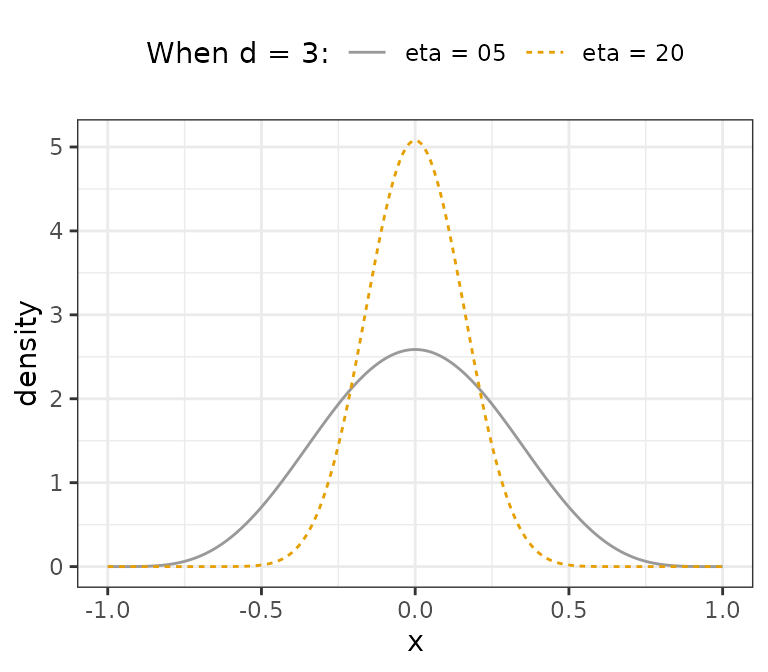

# Detailed guide to setting priors

## Default priors

We begin by loading the package:

``` r
library(minorbsem)
```

    ## 

    ## ###############################################################################

    ## This is minorbsem 0.2.16.9000

    ## 
    ## All users of R (or SEM) are invited to report bugs, submit functions or ideas
    ## for functions. An efficient way to do this is to open an issue on GitHub
    ## https://github.com/jamesuanhoro/minorbsem/issues/.

    ## ###############################################################################

The default priors are:

``` r
priors_default <- new_mbsempriors()
priors_default
```

    ## An object of class "mbsempriors"
    ## Slot "lkj_shape":
    ## [1] 2
    ## 
    ## Slot "ml_par":
    ## [1] 0
    ## 
    ## Slot "sl_par":
    ## [1] 1
    ## 
    ## Slot "rs_par":
    ## [1] 1
    ## 
    ## Slot "rc_par":
    ## [1] 2
    ## 
    ## Slot "sc_par":
    ## [1] 0.5
    ## 
    ## Slot "rm_par":
    ## [1] 0.15

### `lkj_shape`

The `lkj_shape` parameter is for setting priors on the interfactor
correlation matrix. By default this value is 2, and implies each
correlation in the matrix follows the distribution:
$\frac{r + 1}{2} \sim \text{Beta}(a,a)$, where
$a = \eta + \frac{d - 2}{2}$, where $\eta$ is the `lkj_shape` parameter
and $d$ is the number of factors. For example, for three factors and
$\eta = 5$, $a = 5 + (3 - 2)/2 = 5.5$, so each correlation follows the
distribution: Beta(5.5, 5.5). Assuming $\eta = 20$, we have Beta(20.5,
20.5). Both distributions are visualized below.



We see that larger values of `lkj_shape` can be used to constrain
interfactor correlations.

### `ml_par` and `sl_par`

`ml_par` and `sl_par` are the prior mean and SD for loadings which are
assumed to be normally distributed. Note that factors are assumed to be
standardized.

### `rs_par`

Residual standard deviation parameters are assumed to follow a
location-scale Student-t distribution with degrees of freedom 3
(unchangeable), location 0 (unchangeable) and scale `rs_par`.

### `rc_par`

Residual correlations between indicators assumed $\text{Beta}(a,a)$
where
$a = {\mathsf{r}\mathsf{c}\mathsf{\_}\mathsf{p}\mathsf{a}\mathsf{r}}$.

### `sc_par`

All coefficients in `minorbsem` are assumed to be standardized. These
coefficients are assumed normal with mean 0 (changeable, see [section on
latent regression](#setting-priors-on-specific-coefficients) below) and
SD of `sc_par`.

### `rm_par`

The $\tau$ (or CRMR) parameter and the RMSEA (for `method = "WB"`) are
assumed normal with mean 0 (unchangeable) and SD of `rm_par`.

## Simple changes to default priors

### Holzinger-Swineford example

This dataset is discussed in the [CFA
tutorial](https://jamesuanhoro.github.io/minorbsem/articles/cfa.md).

``` r
item_data <- HS[, paste0("x", 1:9)] # select columns x1:x9
head(item_data) # show first six rows
```

    ##         x1   x2    x3       x4   x5        x6       x7   x8       x9
    ## 1 3.333333 7.75 0.375 2.333333 5.75 1.2857143 3.391304 5.75 6.361111
    ## 2 5.333333 5.25 2.125 1.666667 3.00 1.2857143 3.782609 6.25 7.916667
    ## 3 4.500000 5.25 1.875 1.000000 1.75 0.4285714 3.260870 3.90 4.416667
    ## 4 5.333333 7.75 3.000 2.666667 4.50 2.4285714 3.000000 5.30 4.861111
    ## 5 4.833333 4.75 0.875 2.666667 4.00 2.5714286 3.695652 6.30 5.916667
    ## 6 5.333333 5.00 2.250 1.000000 3.00 0.8571429 4.347826 6.65 7.500000

The scale of data is important for setting priors on model parameters.
The default priors for models fit with `minorbsem` are reasonable when
variables have standard deviations close to 1. For this reason, we first
check the standard deviations of the relevant variables for this
analysis:

``` r
apply(item_data, 2, sd) # compute SD of each variable
```

    ##       x1       x2       x3       x4       x5       x6       x7       x8       x9 
    ## 1.167432 1.177451 1.130979 1.164116 1.290472 1.095603 1.089534 1.012615 1.009152

All variables have standard deviations close to 1, so we can move
forward with the data as they are. Otherwise, we would recommend
re-scaling the variables.[¹](#fn1)

``` r
syntax_basic <- "
Visual =~ x1 + x2 + x3
Verbal =~ x4 + x5 + x6
Speed =~ x7 + x8 + x9"
```

Let’s fit the model with modified priors:

``` r
priors_modified <- new_mbsempriors(lkj_shape = 10, sl_par = .75)
priors_modified
```

    ## An object of class "mbsempriors"
    ## Slot "lkj_shape":
    ## [1] 10
    ## 
    ## Slot "ml_par":
    ## [1] 0
    ## 
    ## Slot "sl_par":
    ## [1] 0.75
    ## 
    ## Slot "rs_par":
    ## [1] 1
    ## 
    ## Slot "rc_par":
    ## [1] 2
    ## 
    ## Slot "sc_par":
    ## [1] 0.5
    ## 
    ## Slot "rm_par":
    ## [1] 0.15

We can fit make the call to the
[`minorbsem()`](https://jamesuanhoro.github.io/minorbsem/reference/minorbsem.md)
function and obtain the data list passed to Stan instead of fitting the
model by setting `ret_data_list = TRUE`:

``` r
base_dl <- minorbsem(
  syntax_basic, item_data,
  priors = priors_modified, ret_data_list = TRUE
)
```

    ## Processing user input ...

``` r
base_dl$shape_phi_c # reflects the shape of interfactor correlation matrix
```

    ## [1] 10

``` r
base_dl$load_est # reflects prior mean for loadings
```

    ##    Visual Verbal Speed
    ## x1      0      0     0
    ## x2      0      0     0
    ## x3      0      0     0
    ## x4      0      0     0
    ## x5      0      0     0
    ## x6      0      0     0
    ## x7      0      0     0
    ## x8      0      0     0
    ## x9      0      0     0

``` r
base_dl$load_se # reflects prior SD for loadings
```

    ##    Visual Verbal Speed
    ## x1   0.75   0.75  0.75
    ## x2   0.75   0.75  0.75
    ## x3   0.75   0.75  0.75
    ## x4   0.75   0.75  0.75
    ## x5   0.75   0.75  0.75
    ## x6   0.75   0.75  0.75
    ## x7   0.75   0.75  0.75
    ## x8   0.75   0.75  0.75
    ## x9   0.75   0.75  0.75

``` r
base_dl$loading_pattern # shows indices for non-zero loadings
```

    ##    Visual Verbal Speed
    ## x1      1      0     0
    ## x2      2      0     0
    ## x3      3      0     0
    ## x4      0      4     0
    ## x5      0      5     0
    ## x6      0      6     0
    ## x7      0      0     7
    ## x8      0      0     8
    ## x9      0      0     9

We can either run the model with:

``` r
base_mod <- minorbsem(syntax_basic, item_data, priors = priors_modified)
```

or

``` r
base_mod <- minorbsem(data_list = base_dl, priors = priors_modified)
```

The results would be identical. Adding `priors = priors_modified` is
optional.[²](#fn2)

## Examples of priors on specific loadings and coefficients

### Small variance prior on all cross-loadings

Following Muthén and Asparouhov (2012), one can estimate all
cross-loadings by placing small variance priors on them. Note that
minorbsem contains a cleaner approach to the same task with models of
the form: `minorbsem(..., simple_struc = FALSE)`. But we demonstrate the
small variance approach to show how to set specific priors on some
loadings.

``` r
syntax_cross <- paste(
  paste0("Visual =~ ", paste0("x", 1:9, collapse = " + ")),
  paste0("Verbal =~ ", paste0("x", 1:9, collapse = " + ")),
  paste0("Speed =~ ", paste0("x", 1:9, collapse = " + ")),
  sep = "\n"
)
writeLines(syntax_cross)
```

    ## Visual =~ x1 + x2 + x3 + x4 + x5 + x6 + x7 + x8 + x9
    ## Verbal =~ x1 + x2 + x3 + x4 + x5 + x6 + x7 + x8 + x9
    ## Speed =~ x1 + x2 + x3 + x4 + x5 + x6 + x7 + x8 + x9

Then we call
[`minorbsem()`](https://jamesuanhoro.github.io/minorbsem/reference/minorbsem.md)
with `ret_data_list = TRUE` to obtain the data list:

``` r
small_var_dl <- minorbsem(syntax_cross, item_data, ret_data_list = TRUE)
```

    ## Processing user input ...

Set all cross-loadings to have prior SDs of 0.1:

``` r
small_var_dl$load_se
```

    ##    Visual Verbal Speed
    ## x1      1      1     1
    ## x2      1      1     1
    ## x3      1      1     1
    ## x4      1      1     1
    ## x5      1      1     1
    ## x6      1      1     1
    ## x7      1      1     1
    ## x8      1      1     1
    ## x9      1      1     1

``` r
small_var_dl$load_se[4:9, 1] <- 0.1
small_var_dl$load_se[-c(4:6), 2] <- 0.1
small_var_dl$load_se[1:6, 3] <- 0.1
small_var_dl$load_se
```

    ##    Visual Verbal Speed
    ## x1    1.0    0.1   0.1
    ## x2    1.0    0.1   0.1
    ## x3    1.0    0.1   0.1
    ## x4    0.1    1.0   0.1
    ## x5    0.1    1.0   0.1
    ## x6    0.1    1.0   0.1
    ## x7    0.1    0.1   1.0
    ## x8    0.1    0.1   1.0
    ## x9    0.1    0.1   1.0

Before fitting the model, minorbsem automatically identifies an
indicator per factor that it uses to align the factor in the right
direction. Given that all indicators reflect all factors, we would need
to identify these indicators manually:

``` r
small_var_dl$markers
```

    ## [1] 1 1 1

``` r
small_var_dl$markers <- c(1, 4, 7) # for visual, verbal and speed respectively
```

Then fit the model:

``` r
small_var_mod <- minorbsem(data_list = small_var_dl)
```

    ##                     Parameter estimates (method = normal, sample size(s) = 301)                     
    ##             from     op   to         mean      sd   5.000%   95.000%    rhat   ess_bulk  
    ##           ───────────────────────────────────────────────────────────────────────────────
    ##             Goodness of fit                                                              
    ##           ───────────────────────────────────────────────────────────────────────────────
    ##             PPP                     0.427                              1.002       1847  
    ##             RMSE                    0.027   0.013    0.008     0.049   1.001        540  
    ##           ───────────────────────────────────────────────────────────────────────────────
    ##             Factor loadings                                                              
    ##           ───────────────────────────────────────────────────────────────────────────────
    ##             Visual   =~   x1        0.752   0.116    0.570     0.950   1.000       1796  
    ##             Visual   =~   x2        0.557   0.102    0.393     0.732   1.000       2515  
    ##             Visual   =~   x3        0.752   0.107    0.575     0.928   1.000       1931  
    ##             Visual   =~   x4        0.035   0.074   -0.087     0.153   1.002       2831  
    ##             Visual   =~   x5       -0.067   0.080   -0.198     0.064   1.002       2438  
    ##             Visual   =~   x6        0.067   0.073   -0.054     0.185   1.002       2854  
    ##             Visual   =~   x7       -0.141   0.079   -0.271    -0.014   1.000       2196  
    ##             Visual   =~   x8        0.007   0.081   -0.126     0.143   1.001       2318  
    ##             Visual   =~   x9        0.215   0.072    0.099     0.329   1.000       2456  
    ##             Verbal   =~   x1        0.124   0.081   -0.017     0.252   1.000       2479  
    ##             Verbal   =~   x2        0.013   0.071   -0.109     0.129   1.000       3101  
    ##             Verbal   =~   x3       -0.080   0.075   -0.203     0.046   1.001       2881  
    ##             Verbal   =~   x4        0.979   0.078    0.856     1.109   1.001       2310  
    ##             Verbal   =~   x5        1.141   0.086    1.004     1.286   1.000       2292  
    ##             Verbal   =~   x6        0.886   0.073    0.773     1.008   1.001       2033  
    ##             Verbal   =~   x7        0.026   0.073   -0.097     0.147   1.001       2427  
    ##             Verbal   =~   x8       -0.036   0.074   -0.159     0.089   1.002       2860  
    ##             Verbal   =~   x9        0.034   0.067   -0.077     0.143   1.001       2373  
    ##             Speed    =~   x1        0.051   0.082   -0.085     0.182   1.002       2954  
    ##             Speed    =~   x2       -0.052   0.074   -0.175     0.069   1.000       3306  
    ##             Speed    =~   x3        0.041   0.078   -0.090     0.166   1.001       3077  
    ##             Speed    =~   x4        0.001   0.070   -0.115     0.114   1.002       2838  
    ##             Speed    =~   x5        0.008   0.076   -0.119     0.136   1.000       2797  
    ##             Speed    =~   x6        0.001   0.068   -0.110     0.112   1.000       2823  
    ##             Speed    =~   x7        0.731   0.099    0.569     0.899   1.000       1672  
    ##             Speed    =~   x8        0.779   0.102    0.620     0.961   1.000       1628  
    ##             Speed    =~   x9        0.539   0.085    0.402     0.679   1.001       2146  
    ##           ───────────────────────────────────────────────────────────────────────────────
    ##             Inter-factor correlations                                                    
    ##           ───────────────────────────────────────────────────────────────────────────────
    ##             Verbal   ~~   Visual    0.360   0.106    0.180     0.527   1.001       2200  
    ##             Speed    ~~   Visual    0.323   0.130    0.096     0.522   1.000       2226  
    ##             Speed    ~~   Verbal    0.239   0.117    0.037     0.422   1.001       1951  
    ##           ───────────────────────────────────────────────────────────────────────────────
    ##             Residual variances                                                           
    ##           ───────────────────────────────────────────────────────────────────────────────
    ##             x1       ~~   x1        0.670   0.131    0.445     0.873   1.001       1861  
    ##             x2       ~~   x2        1.089   0.118    0.904     1.280   1.001       2892  
    ##             x3       ~~   x3        0.729   0.129    0.516     0.936   1.001       1854  
    ##             x4       ~~   x4        0.375   0.088    0.226     0.511   1.001       1759  
    ##             x5       ~~   x5        0.420   0.112    0.233     0.600   1.001       2068  
    ##             x6       ~~   x6        0.374   0.074    0.248     0.493   1.002       1890  
    ##             x7       ~~   x7        0.698   0.117    0.500     0.886   1.001       1532  
    ##             x8       ~~   x8        0.443   0.123    0.215     0.620   1.001       1250  
    ##             x9       ~~   x9        0.583   0.076    0.459     0.710   1.000       2648  
    ##           ───────────────────────────────────────────────────────────────────────────────
    ##                                                                                          
    ## 
    ## Column names: from, op, to, mean, sd, 5%, 95%, rhat, ess_bulk

### Priors on specific coefficients

Consider the latent regression model:

``` r
syntax_reg <- "
Visual =~ x1 + x2 + x3 + x9
Verbal =~ x4 + x5 + x6
Speed =~ x7 + x8 + x9
Verbal ~ Visual + Speed"
```

Assume we believe the most likely estimate of the coefficient from
visual to verbal is .5, we can change the prior mean for this
coefficient to .5. We first retrieve the data list object.

``` r
reg_dl <- minorbsem(
  syntax_reg, item_data,
  ret_data_list = TRUE
)
```

    ## Processing user input ...

``` r
reg_dl$coef_pattern # coefficient pattern, note non-zero cells
```

    ##        Visual Verbal Speed
    ## Visual      0      0     0
    ## Verbal      1      0     2
    ## Speed       0      0     0

``` r
reg_dl$coef_est # default prior means
```

    ##        Visual Verbal Speed
    ## Visual      0      0     0
    ## Verbal      0      0     0
    ## Speed       0      0     0

``` r
reg_dl$coef_est["Verbal", "Visual"] <- .5
reg_dl$coef_est # updated
```

    ##        Visual Verbal Speed
    ## Visual    0.0      0     0
    ## Verbal    0.5      0     0
    ## Speed     0.0      0     0

``` r
reg_dl$coef_se # default prior SDs
```

    ##        Visual Verbal Speed
    ## Visual    0.5    0.5   0.5
    ## Verbal    0.5    0.5   0.5
    ## Speed     0.5    0.5   0.5

Then we fit the model with the updated data list:

``` r
reg_mod <- minorbsem(data_list = reg_dl)
```

    ##                     Parameter estimates (method = normal, sample size(s) = 301)                     
    ##              from     op   to        mean      sd   5.000%   95.000%    rhat   ess_bulk  
    ##            ──────────────────────────────────────────────────────────────────────────────
    ##              Goodness of fit                                                             
    ##            ──────────────────────────────────────────────────────────────────────────────
    ##              PPP                    0.383                              1.001       1536  
    ##              RMSE                   0.037   0.012    0.019     0.058   1.002        591  
    ##            ──────────────────────────────────────────────────────────────────────────────
    ##              Regression coefficients (outcome ~ predictor)                               
    ##            ──────────────────────────────────────────────────────────────────────────────
    ##              Verbal   ~    Visual   0.418   0.075    0.291     0.543   1.009       1520  
    ##              Verbal   ~    Speed    0.080   0.079   -0.053     0.208   1.003       2212  
    ##            ──────────────────────────────────────────────────────────────────────────────
    ##              R square                                                                    
    ##            ──────────────────────────────────────────────────────────────────────────────
    ##              Visual   ~~   Visual   0.000   0.000    0.000     0.000                     
    ##              Verbal   ~~   Verbal   0.208   0.058    0.119     0.310   1.006       1894  
    ##              Speed    ~~   Speed    0.000   0.000    0.000     0.000                     
    ##            ──────────────────────────────────────────────────────────────────────────────
    ##              Factor loadings                                                             
    ##            ──────────────────────────────────────────────────────────────────────────────
    ##              Visual   =~   x1       0.919   0.105    0.754     1.106   1.002        718  
    ##              Visual   =~   x2       0.495   0.089    0.349     0.638   1.002       1936  
    ##              Visual   =~   x3       0.646   0.088    0.500     0.792   1.002       1702  
    ##              Visual   =~   x9       0.397   0.079    0.267     0.528   1.000       2152  
    ##              Verbal   =~   x4       0.997   0.074    0.881     1.125   1.002       1598  
    ##              Verbal   =~   x5       1.084   0.079    0.956     1.216   1.001       2344  
    ##              Verbal   =~   x6       0.927   0.066    0.818     1.037   1.004       2247  
    ##              Speed    =~   x9       0.443   0.089    0.304     0.595   1.001       1729  
    ##              Speed    =~   x7       0.648   0.092    0.505     0.802   1.002       1525  
    ##              Speed    =~   x8       0.845   0.103    0.680     1.017   1.004       1162  
    ##            ──────────────────────────────────────────────────────────────────────────────
    ##              Inter-factor correlations                                                   
    ##            ──────────────────────────────────────────────────────────────────────────────
    ##              Verbal   ~~   Visual   0.000   0.000    0.000     0.000                     
    ##              Speed    ~~   Visual   0.272   0.088    0.125     0.417   1.001       2880  
    ##              Speed    ~~   Verbal   0.000   0.000    0.000     0.000                     
    ##            ──────────────────────────────────────────────────────────────────────────────
    ##              Residual variances                                                          
    ##            ──────────────────────────────────────────────────────────────────────────────
    ##              x1       ~~   x1       0.525   0.172    0.195     0.767   1.005        614  
    ##              x2       ~~   x2       1.144   0.113    0.967     1.338   1.001       2797  
    ##              x3       ~~   x3       0.859   0.108    0.687     1.040   1.001       1521  
    ##              x9       ~~   x9       0.580   0.081    0.450     0.710   1.000       2098  
    ##              x4       ~~   x4       0.357   0.106    0.175     0.526   1.000       1152  
    ##              x5       ~~   x5       0.493   0.119    0.297     0.689   1.001       1622  
    ##              x6       ~~   x6       0.348   0.090    0.202     0.492   1.004       1646  
    ##              x7       ~~   x7       0.773   0.116    0.581     0.952   1.002       1436  
    ##              x8       ~~   x8       0.319   0.158    0.028     0.566   1.005        960  
    ##            ──────────────────────────────────────────────────────────────────────────────
    ##                                                                                          
    ## 
    ## Column names: from, op, to, mean, sd, 5%, 95%, rhat, ess_bulk

We also show results from the fit with default priors:

``` r
reg_def_priors <- minorbsem(syntax_reg, item_data)
```

    ##                     Parameter estimates (method = normal, sample size(s) = 301)                     
    ##              from     op   to        mean      sd   5.000%   95.000%    rhat   ess_bulk  
    ##            ──────────────────────────────────────────────────────────────────────────────
    ##              Goodness of fit                                                             
    ##            ──────────────────────────────────────────────────────────────────────────────
    ##              PPP                    0.406                              1.000       1728  
    ##              RMSE                   0.038   0.012    0.019     0.059   1.002        666  
    ##            ──────────────────────────────────────────────────────────────────────────────
    ##              Regression coefficients (outcome ~ predictor)                               
    ##            ──────────────────────────────────────────────────────────────────────────────
    ##              Verbal   ~    Visual   0.414   0.076    0.286     0.537   1.002       2628  
    ##              Verbal   ~    Speed    0.082   0.080   -0.052     0.213   1.002       1891  
    ##            ──────────────────────────────────────────────────────────────────────────────
    ##              R square                                                                    
    ##            ──────────────────────────────────────────────────────────────────────────────
    ##              Visual   ~~   Visual   0.000   0.000    0.000     0.000                     
    ##              Verbal   ~~   Verbal   0.206   0.058    0.115     0.305   1.000       3167  
    ##              Speed    ~~   Speed    0.000   0.000    0.000     0.000                     
    ##            ──────────────────────────────────────────────────────────────────────────────
    ##              Factor loadings                                                             
    ##            ──────────────────────────────────────────────────────────────────────────────
    ##              Visual   =~   x1       0.910   0.101    0.750     1.083   1.000       1795  
    ##              Visual   =~   x2       0.496   0.089    0.354     0.641   1.002       2577  
    ##              Visual   =~   x3       0.647   0.086    0.507     0.786   1.001       2525  
    ##              Visual   =~   x9       0.400   0.080    0.266     0.532   1.001       2263  
    ##              Verbal   =~   x4       0.994   0.074    0.875     1.119   1.001       1420  
    ##              Verbal   =~   x5       1.084   0.079    0.956     1.213   1.000       1994  
    ##              Verbal   =~   x6       0.927   0.068    0.822     1.039   1.001       1798  
    ##              Speed    =~   x9       0.446   0.088    0.306     0.591   1.001       1403  
    ##              Speed    =~   x7       0.650   0.096    0.500     0.816   1.001       1543  
    ##              Speed    =~   x8       0.842   0.108    0.668     1.020   1.001       1151  
    ##            ──────────────────────────────────────────────────────────────────────────────
    ##              Inter-factor correlations                                                   
    ##            ──────────────────────────────────────────────────────────────────────────────
    ##              Verbal   ~~   Visual   0.000   0.000    0.000     0.000                     
    ##              Speed    ~~   Visual   0.270   0.087    0.126     0.416   1.001       2005  
    ##              Speed    ~~   Verbal   0.000   0.000    0.000     0.000                     
    ##            ──────────────────────────────────────────────────────────────────────────────
    ##              Residual variances                                                          
    ##            ──────────────────────────────────────────────────────────────────────────────
    ##              x1       ~~   x1       0.538   0.161    0.244     0.777   1.000       1599  
    ##              x2       ~~   x2       1.142   0.110    0.972     1.327   1.000       2459  
    ##              x3       ~~   x3       0.860   0.105    0.689     1.030   1.001       2330  
    ##              x9       ~~   x9       0.575   0.084    0.436     0.709   1.001       2067  
    ##              x4       ~~   x4       0.361   0.105    0.180     0.524   1.003       1151  
    ##              x5       ~~   x5       0.490   0.127    0.283     0.695   1.000       1464  
    ##              x6       ~~   x6       0.348   0.089    0.194     0.487   1.000       1495  
    ##              x7       ~~   x7       0.767   0.120    0.569     0.956   1.001       1337  
    ##              x8       ~~   x8       0.324   0.163    0.032     0.580   1.000        995  
    ##            ──────────────────────────────────────────────────────────────────────────────
    ##                                                                                          
    ## 
    ## Column names: from, op, to, mean, sd, 5%, 95%, rhat, ess_bulk

## Works Cited

Muthén, Bengt, and Tihomir Asparouhov. 2012. “Bayesian Structural
Equation Modeling: A More Flexible Representation of Substantive
Theory.” *Psychological Methods* 17 (3): 313–35.
<https://doi.org/10.1037/a0026802>.

------------------------------------------------------------------------

1.  In the situation where variable scales have no information value,
    one can do a correlation-structure analysis instead using syntax of
    the form: `minorbsem(..., correlation = TRUE)`.

2.  `base_mod` contains a copy of the priors passed to
    [`minorbsem()`](https://jamesuanhoro.github.io/minorbsem/reference/minorbsem.md)
    verbatim in `base_mod@priors`. Note that the model is fitted based
    on the specifications in `base_dl`. So if we ran
    `base_mod <- minorbsem(data_list = base_dl)`, `base_mod@priors`
    would contain the default priors, even though these priors are
    ignored when fitting the model.
